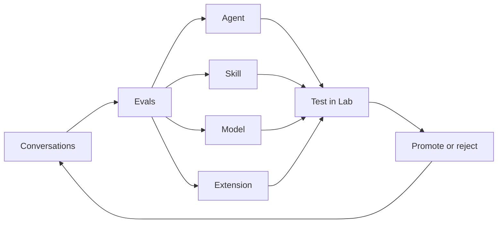

<div align="center">
  <h2>OpenPond Harness</h2>
</div>

OpenPond Harness is an open-source, mutable agent harness designed to improve alongside your work.

### Run without Installation

```bash
npx openpond@latest
```
Requires Node.js 24.18 or newer. Use `npx openpond@latest --no-open` to print the local access URL instead, or `npx openpond@latest tui` to launch the terminal interface.

### Desktop app

Install the latest version from [Github Releases](https://github.com/openpond/openpond/releases)

### Notes

Conversations and settings persist under `~/.openpond/openpond-app`

## What is this

An AI-assisted pipeline turns repeated work, conversations, corrections, and failures into opportunities to improve the system. It surfaces recurring patterns, helps define evals, and recommends the right kind of change—including training approaches such as SFT or RL when a model update is the best fit.

OpenPond can improve both the agents that perform your work and the harness that runs them. It does this through Agents, Skills, trained Models, and Extensions that customize specific parts of the harness.

### The Continuous Improvement Loop



### Why

If your suffering from **what do I build now** syndrome, the answers are in this repository - plus invite your non dev team members and ship them agents.

### Your Profile [docs](docs/public/agents-and-skills.md)

Your profile is the portable, Git-backed version of your OpenPond harness.
- It can contain:
  - Agents - full software packages with instructions, tools, actions, evals, and their own runtime.
  - Skills - smaller reusable instructions and workflows that agents can load.
  - Extensions - deterministic code that modifies specific portions of the harness itself.
- Profiles start local and can stay local. Since they are normal source files backed by Git, you can move the same harness between machines and review every change.
- Sync your profile with OpenPond Pro when you want to share the same harness with your team, use it in Team Chat, Slack, or Microsoft Teams, or continue from another computer.
- Once synced, that same harness can be used for cloud and sandbox runs instead of rebuilding an agent from a private chat.

### Other features

- codex app level UI/UX
- BYOK (subs welcomed)
- subagents
- Team chats (paid)
- Community Chat (discord-eque, open to everyone)
- Ship agents to your teammates
- Openpond Cloud (paid sandbox usage but can use your subs while coding in the cloud)

## Contributions

Contributions are not currently being accepted. Potential contributors will be reviewed on an ongoing basis. This policy helps ensure code quality and keeps AI-assisted contributions aligned with the project's direction and standards.

## License

OpenPond is available under the [MIT License](LICENSE).
