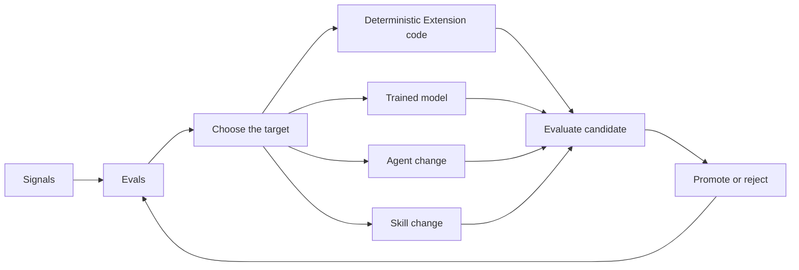

  <h1>OpenPond Harness</h1>
  
<strong>The open-source toolkit to build your own AGI harness.</strong>

  
Agent Builder · Model Trainer · Mutable Harness

  

    
    
  

## Goal

The goal is for OpenPond Harness to become a mutable, continuously improving system you can tweak to your usecase wheather that be in a startup, enterprise, personal project, or OSS project.

We do this via an AI assisted pipeline, baked into our harness.

AI Assisted surfacing of repeated work/conversations & suggesting training algorithms and models that fit your use case. (SFT, RL etc.)

The model has two outputs unique to our harness - agents and the harness itself. The model can modify specific portions of the harness with an extension, and also create a specific "Agent" ....

### Continuous Improvement Loop

- Signals become Evals, then OpenPond chooses the part of the system that needs to change.
- Every change becomes a candidate that gets tested in Lab before it is promoted or rejected, then the results feed back into Evals.

[Docs](docs/public/README.md)

## Main Concepts

### Profile

- Your profile is the portable, Git-backed version of your OpenPond harness.
- It can contain:
  - Agents - full software packages with instructions, tools, actions, evals, and their own runtime.
  - Skills - smaller reusable instructions and workflows that agents can load.
  - Extensions - deterministic code that modifies specific portions of the harness itself.
- Profiles start local and can stay local. Since they are normal source files backed by Git, you can move the same harness between machines and review every change.
- Sync your profile with OpenPond Premium when you want to share the same harness with your team, use it in Team Chat, Slack, or Microsoft Teams, or continue from another computer.
- Once synced, that same harness can be used for cloud and sandbox runs instead of rebuilding an agent from a private chat.

[Docs](docs/public/agents-and-skills.md)

### Training on your Chats

- Select useful chats, add them to a dataset, and let OpenPond recommend the training approach—such as SFT, RL, or GRPO—that best fits the work.
- The aim is to reduce repeated frontier-model mistakes, speed up the job, and lower costs.
- Training currently targets local models, while Tasksets can be exported for RunPod or Prime-hosted training, or used with OpenPond Managed Training when it becomes available.

[Docs](docs/public/training.md)

### Hybrid: Local <> Cloud

- Hybrid mode lets you use your existing subscriptions on your local machine while editing code in OpenPond cloud sandboxes.
- OpenPond spins up a sandbox for each coding session, and the harness routes file operations and commands through sandboxed tools instead of local ones.

[Docs](docs/public/local-cloud.md)

## Contributions

Contributions are not currently being accepted. Potential contributors will be reviewed on an ongoing basis. This policy helps ensure code quality and keeps AI-assisted contributions aligned with the project's direction and standards.

## License

OpenPond is available under the [MIT License](LICENSE).
