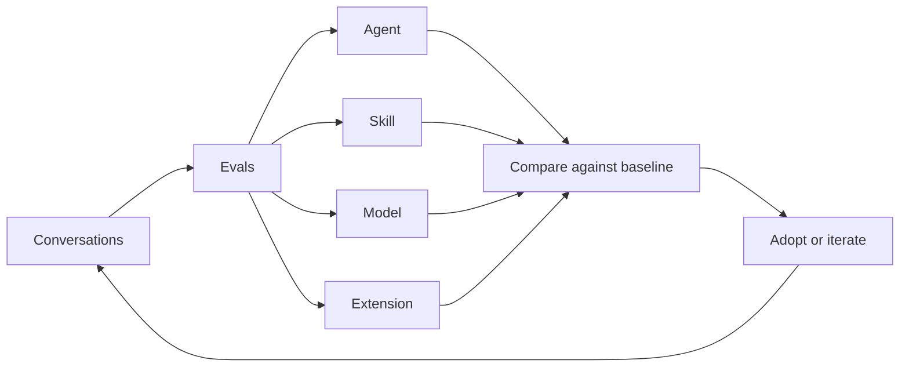

<div align="center">
  <h2>OpenPond Harness</h2>
</div>

OpenPond Harness is an open-source, mutable agent harness designed to continuously improve alongside your work.

- Harness is adaptable to your daily workflow - code agents/skills/harness extensions and train models, all in the same harness, 100% opensource and owned by you.
- The training module is optimized for smaller models, SFT and RL techniques are in beta.
- Works with fireworks RFT (BYOK) and coming soon, Openpond Managed.



## Installation

```bash
npm install --g openpond
openpond
```

### Run without Installation

```bash
npx openpond@latest # Start local Node server and web UI

npx openpond tui         # Terminal UI
npx openpond serve       # Headless API server
npx openpond ui --no-open # Web server without opening a browser
```
Requires Node.js 24.18 or newer.

### Desktop app

Install the latest version from [Github Releases](https://github.com/openpond/openpond/releases)

> [!NOTE]
> package managers coming soon

Conversations and settings persist under `~/.openpond/openpond-app`

### Install via git

```bash
git clone https://github.com/openpond/openpond.git
cd openpond

corepack enable # Enable the pnpm version pinned by this repository
pnpm install --frozen-lockfile
pnpm dev # Server & Desktop App
pnpm dev:web # Server & Web
```

Corepack is only needed when running from source. It makes the repository's pinned `pnpm@11.13.0` command available; if that pnpm version is already installed, you can skip `corepack enable`.

## What is this

An harness optimized to turn your conversations into datasets, run evals and faciliate code updates (agents/skills/extensions) or facilitate model training (local SFT, alpha support for RFT with fireworks BYOK, Openpond Managed RFT coming soon).

## Profile

Your profile is the portable mutable, Git-backed version of your OpenPond harness, syncable to your team and the Openpond Cloud for RFT rollouts. [docs](docs/public/agents-and-skills.md)

#### Agents
- full software packages with instructions, tools, actions, evals, and their own runtime.
- shippable to non technical team members

#### Skills
- standard markdown files for generalized instructions

#### Extensions
- code & models that modifies specific portions of the harness itself.

| Feature | Extension | Code | Model |
| --- | --- | :---: | :---: |
| Resource search | Beta | ✅ | ☐ |
| Compaction | Planned | ☐ | ☐ |

- Profiles start local and can stay local. Since they are normal source files backed by Git, you can move the same harness between machines and review every change.
- Sync your profile with OpenPond Pro when you want to share the same harness with your team, use it in Team Chat, Slack, or Microsoft Teams, or continue from another computer.
- Once synced, that same harness can be used for cloud and sandbox runs instead of rebuilding an agent from a private chat.

### Other features

- codex app level UI/UX
- BYOK (subs welcomed)
- subagents
- Team chats (paid)
- Community Chat (discord-eque, open to everyone)
- Ship agents to your teammates
- Openpond Cloud (paid sandbox usage but can use your subs while coding in the cloud)

## Contributions

Contributions are not currently being accepted. Potential contributors will be reviewed on an ongoing basis. This policy helps ensure code quality and keeps AI-assisted contributions aligned with the project's direction and standards.

## License

OpenPond is available under the [MIT License](LICENSE).
