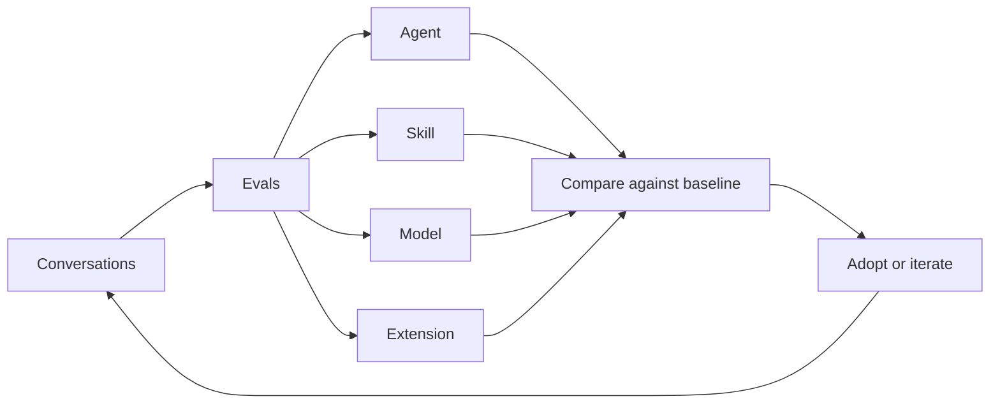

<div align="center">
  <h2>OpenPond Harness</h2>
</div>

OpenPond Harness is an open-source, mutable agent harness designed to improve alongside your work.

## Installation

### Run without Installalltion

```bash
npx openpond@latest # Start local Node server and web UI

npx openpond tui         # Terminal UI
npx openpond serve       # Headless API server
npx openpond ui --no-open # Web server without opening a browser
```
Requires Node.js 24.18 or newer.

### Install globally with npm

```bash
npm install --global openpond
openpond
```

The global command launches the same local server and browser UI as `npx openpond@latest`.

### Desktop app

Install the latest version from [Github Releases](https://github.com/openpond/openpond/releases)

> [!NOTE]
> Pending uploads to package managers

Conversations and settings persist under `~/.openpond/openpond-app`

### Install via git

```bash
git clone https://github.com/openpond/openpond.git
cd openpond

corepack enable # Enable the pnpm version pinned by this repository
pnpm install --frozen-lockfile
pnpm dev
```

Corepack is only needed when running from source. It makes the repository's pinned `pnpm@11.13.0` command available; if that pnpm version is already installed, you can skip `corepack enable`.

`pnpm dev` launches the Desktop app. To run the browser development UI instead, use `pnpm run dev:web` and open the URL printed in the terminal.

## What is this

An AI-assisted pipeline turns repeated work, conversations, corrections, and failures into opportunities to improve the system. It surfaces recurring patterns, helps define evals, and recommends the right kind of change—including training approaches such as SFT or RL when a model update is the best fit.

OpenPond can improve both the agents that perform your work and the harness that runs them. It does this through Agents, Skills, trained Models, and Extensions that customize specific parts of the harness.

### The Continuous Improvement Loop



### Your Profile [docs](docs/public/agents-and-skills.md)

Your profile is the portable, Git-backed version of your OpenPond harness.
- It can contain:
  - Agents - full software packages with instructions, tools, actions, evals, and their own runtime.
  - Skills - smaller reusable instructions and workflows that agents can load.
  - Extensions - deterministic code that modifies specific portions of the harness itself.
- Profiles start local and can stay local. Since they are normal source files backed by Git, you can move the same harness between machines and review every change.
- Sync your profile with OpenPond Pro when you want to share the same harness with your team, use it in Team Chat, Slack, or Microsoft Teams, or continue from another computer.
- Once synced, that same harness can be used for cloud and sandbox runs instead of rebuilding an agent from a private chat.

### Other features

- codex app level UI/UX
- BYOK (subs welcomed)
- subagents
- Team chats (paid)
- Community Chat (discord-eque, open to everyone)
- Ship agents to your teammates
- Openpond Cloud (paid sandbox usage but can use your subs while coding in the cloud)

## Contributions

Contributions are not currently being accepted. Potential contributors will be reviewed on an ongoing basis. This policy helps ensure code quality and keeps AI-assisted contributions aligned with the project's direction and standards.

## License

OpenPond is available under the [MIT License](LICENSE).
