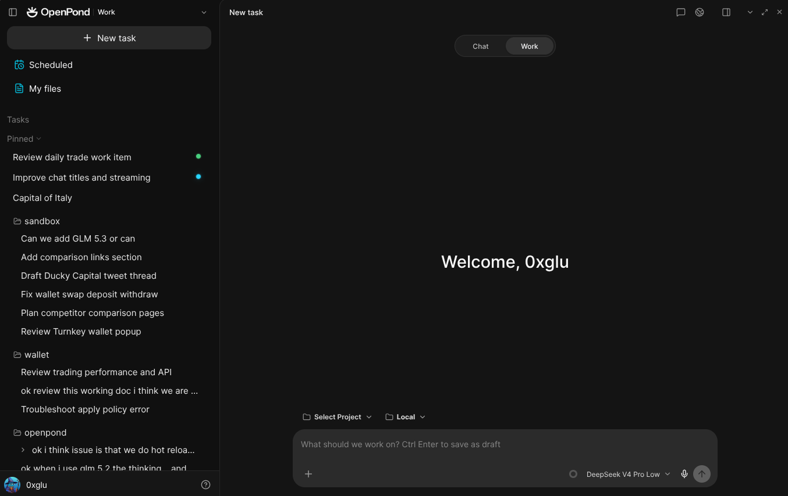

<div align="center">
  <h1>OpenPond</h1>
  <p><strong>Get real work done with agents.</strong></p>
</div>

OpenPond is an open-source, local-first agent workspace and runtime.

- Run the same task from Desktop, Web, CLI, or TUI.
- Give agents scoped access to Git projects, files, terminal commands, browser
  tools, and isolated cloud sandboxes.
- Keep the conversation, tool calls, command output, files, code changes, and
  result together with the project.
- Use Refiner to review bounded evidence from completed work and return no
  action, a reviewable Harness proposal, or a route to the owning system.
- Build Tasksets and run evaluations before using evidence for model training;
  a completed conversation is not automatically treated as training data.



## Installation

```bash
npm install --g openpond
openpond
```

### Run without Installation

```bash
npx openpond@latest # Start local Node server and web UI

npx openpond tui         # Terminal UI
npx openpond serve       # Headless API server
npx openpond ui --no-open # Web server without opening a browser
```
Requires Node.js 24.18 or newer.

### Desktop app

Install the latest version from [Github Releases](https://github.com/openpond/openpond/releases)

> [!NOTE]
> package managers coming soon

Conversations and settings persist under `~/.openpond/openpond-app`

### Install via git

```bash
git clone https://github.com/openpond/openpond.git
cd openpond

corepack enable # Enable the pnpm version pinned by this repository
pnpm install --frozen-lockfile
pnpm dev # Server & Desktop App
pnpm dev:web # Server & Web
```

Corepack is only needed when running from source. It makes the repository's pinned `pnpm@11.13.0` command available; if that pnpm version is already installed, you can skip `corepack enable`.

## npm packages

OpenPond publishes four packages to npm. Internal application and workspace
packages are implementation details and are documented in the
[development guide](docs/public/development.md).

| Package | Role |
| --- | --- |
| [`openpond`](https://www.npmjs.com/package/openpond) | CLI, TUI, Local OpenPond app, and bundled app-server executable. |
| [`openpond-sdk`](https://www.npmjs.com/package/openpond-sdk) | Server-side TypeScript SDK for hosted Work and sandboxes. |
| [`@openpond/harness`](https://www.npmjs.com/package/@openpond/harness) | Portable immutable Harness releases, workspaces, improvements, tools, models, and Refiner contracts. |
| [`@openpond/evals`](https://www.npmjs.com/package/@openpond/evals) | Portable Tasksets, graders, evaluation runs, receipts, conformance, and Work evidence. |

Harness is the dependency base for Evals: `@openpond/evals` depends on
`@openpond/harness`, applications import both packages directly, and Harness
never imports Evals.

## What is this

A harness optimized to turn your conversations into datasets, run evals and facilitate code updates (agents/skills/extensions) or model training through local training and OpenPond Managed RL.

## Refine the harness

The Refiner turns a completed turn into a bounded, reviewable improvement decision. It examines only the evidence you provide, then either returns no action, proposes a targeted change to an available Harness layer, or routes an issue to its actual owner. Proposed changes receive a separate model critique and deterministic admission checks before a host can apply them.

Use the provider-neutral Refiner from @openpond/harness with your own model stream and authorized evidence packet:

~~~ts
import { authorLocalHarnessRefinementWithModel } from "@openpond/harness";

const decision = await authorLocalHarnessRefinementWithModel({
  evidence, // bounded observations, turn history, sources, and capabilities
  stream: ({ messages, signal }) => provider.stream({ messages, signal }),
  signal: new AbortController().signal,
});

if (decision.decision === "propose") {
  // Present the proposal for host validation and review before applying it.
  console.log(decision.route, decision.summary);
}
~~~

The Refiner never treats a prompt keyword, an error string, or a fixed recurrence count as authority to change the Harness. See the [@openpond/harness README](packages/harness/README.md) for the evidence contract, decision schema, and verification command.

## Use the SDK with an API key

Use [openpond-sdk](https://www.npmjs.com/package/openpond-sdk) from a Node.js server, worker, or Next.js route handler to run hosted Work and manage sandboxes directly. Create an OpenPond API key, keep it in server-side configuration, and never expose it in browser code or a NEXT_PUBLIC_* variable.

~~~bash
npm install openpond-sdk
export OPENPOND_API_KEY="opk_..."
~~~

~~~ts
import { createOpenPondClient } from "openpond-sdk";

const openpond = createOpenPondClient({
  apiKey: process.env.OPENPOND_API_KEY!,
});

const result = await openpond.work.run({
  prompt: "Review this repository and summarize the highest-priority issues.",
  cleanup: "delete",
  discardOutputs: true,
});

console.log(result.text);
~~~

work.run creates a sandbox when you do not supply one. For files you want to keep, provide persistOutput instead of discardOutputs; for direct sandbox lifecycle and command access, use openpond.sandboxes. The [SDK README](packages/sdk/README.md) includes complete Work, output-persistence, workflow, and raw-sandbox examples.

### Other features

- codex app level UI/UX
- BYOK (subs welcomed)
- subagents
- Team chats (paid)
- Community Chat (discord-eque, open to everyone)
- Ship agents to your teammates
- Openpond Cloud (paid sandbox usage but can use your subs while coding in the cloud)

## Contributions

Contributions are not currently being accepted. Potential contributors will be reviewed on an ongoing basis. This policy helps ensure code quality and keeps AI-assisted contributions aligned with the project's direction and standards.

## License

OpenPond is available under the [MIT License](LICENSE).
