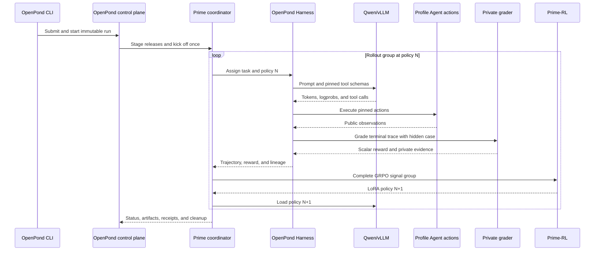

# Profile-Bound On-Policy GRPO

Date: 2026-07-25  
Status: Locked architecture; live single-rollout protocol proven, grouped GRPO update/reload pending

Related implementation plans:

- [Profile-Bound GRPO Runtime Blockers](../working-docs/training/2026-07-24-profile-bound-grpo-runtime-blockers.md)
- [Chat-Authored Datasets, GRPO Harness Proof, and Shared Serving](../working-docs/training/2026-07-24-chat-authored-datasets-grpo-and-shared-serving-proof.md)

## Abstract

OpenPond starts one immutable training job. It does not conduct every rollout
from the CLI or textarea. After kickoff, a coordinator on the Prime node owns
task sampling, policy-version selection, grouped rollout scheduling, Qwen/vLLM
inference, Prime-RL updates, and LoRA reloads. It initiates each episode against
a remote OpenPond Harness.

For the first proof, that Harness runs in the local OpenPond process on CPU. It
owns the selected immutable Profile, the two pinned Agent actions, episode
state, private deterministic grading, and cleanup. Later, a Sandbox CPU
replaces the local host without changing the protocol.

## One Run



The “Prime GPU handles rollouts” shorthand means the Prime node hosts the
rollout coordinator, vLLM/Qwen, and Prime-RL. The coordinator is a service on
that node; the GPU hardware performs model inference and training.

## Ownership

| Boundary | Owner |
| --- | --- |
| Dataset and Harness publication | OpenPond |
| One-time run submission, approval, and kickoff | OpenPond |
| Per-rollout task and policy-version scheduling | Prime coordinator |
| Qwen generation, tokens, and logprobs | vLLM on Prime |
| Profile Agent action execution | OpenPond Harness |
| Hidden case state and deterministic reward | OpenPond Harness |
| GRPO update and LoRA checkpoints | Prime-RL |
| Status, cancellation, artifact collection, and cleanup | Connected-worker protocol and OpenPond |

## Dataset Contract

The Dataset contains task prompts, stable private-bound `caseId` references,
and split metadata. It does not contain gold assistant trajectories. During
training, Qwen generates fresh messages and tool calls from the current policy.
The Harness binds the selected case privately, exposes only the two Profile
tools, and supplies the scalar reward after the terminal action.

## Proven Rollout

On 2026-07-25, OpenPond completed run
`prime_rollout_dcc27fa5-2f9b-4cc9-806e-bb774b9af710` from one approved CLI
kickoff. It provisioned raw Prime, uploaded the immutable release graph by
SCP, and started a coordinator through pinned SSH. The coordinator assigned a
train task to the local non-UI Harness. The Harness called the exact
`Qwen/Qwen3-0.6B@c1899de289a04d12100db370d81485cdf75e47ca` policy through
vLLM 0.24.0, privately bound the episode to the two Profile Agent actions, and
ran three calls:

```text
get_portfolio_snapshot
submit_budget_decision       # publicly rejected
submit_budget_decision       # repaired and accepted
```

The private deterministic grader returned reward `0.829526`; the result,
assignment, action traces, vLLM log, upload identity, and cleanup state were
collected under one content-hashed report. The Prime pod and both tunnels were
closed.

## Current Gap

The proof ends at a privately graded trajectory. The production Prime-RL
worker still needs complete token IDs, masks, original logprobs, temperatures,
and policy-version lineage assembled into non-constant GRPO groups. It then
needs to execute the optimizer, return the canonical LoRA, reload policy
version N+1, and demonstrate that the next group is served from that version.
The current connected worker's signal-journal/update code exists, but this
grouped rollout-to-update-to-reload handshake is not yet connected to the
live-proven coordinator.

## Boundaries

- The textarea is a manual analogy, not the training controller.
- The student cannot select or change its hidden case.
- Reward details and hidden fixtures never enter student-visible messages.
- Prime credential verification does not provision or spend.
- The sub-billion smoke proves the protocol; it does not prove Qwen3-8B shared serving.
