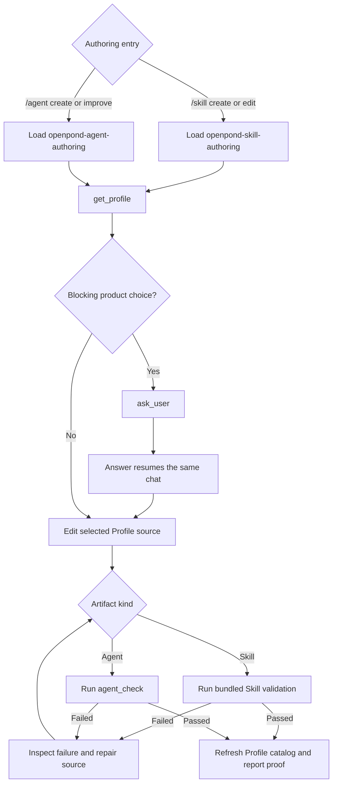
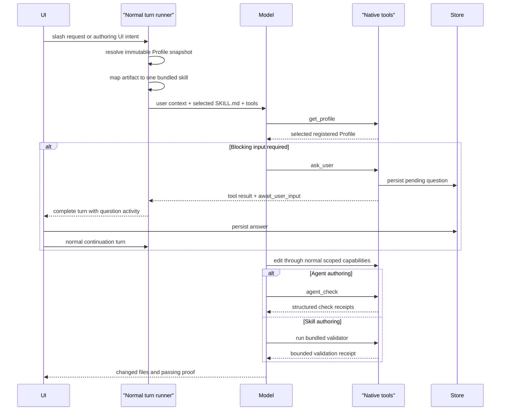

# Skill-Backed Agent and Skill Authoring

**Date:** 2026-07-23

**Status:** Implemented in PR #49; integrated with the OpenPond Goal/Insights removal follow-up

**Scope:** Replace Goal-backed Agent and Skill authoring with normal model turns that automatically load bundled OpenPond authoring skills, edit the selected Profile directly, and use narrow supporting tools only for Profile authority, user questions, and validation

> **Latest checkpoint — 2026-07-27:** PR #49 landed the recent Agent/training cleanup and the skill-driven authoring implementation: `/skill` and `/agent` are normal slash-command turns that hardcode only `openpond-skill-authoring` or `openpond-agent-authoring`, then use the ordinary hosted model/tool loop. The bundled `SKILL.md` packages contain the workflow; they are not tools or modes and contain no `agents/openai.yaml`. `get_profile`, `ask_user`, and the `agent_*` checks remain narrow supporting tools. The follow-up removal in [Remove OpenPond Goals and Insights, Preserve Codex Goals](2026-07-27-openpond-goal-insights-removal.md) deletes the now-unneeded general OpenPond Goal runtime without changing this authoring architecture.

Related docs:

- [OpenPond Continuous Improvement System](2026-07-15-openpond-continuous-improvement-system.md) — remains authoritative for Model training, Tasksets, Evals, and other target types; this document supersedes its shared `CreateImproveRun` requirement for Agent and Skill source authoring.
- [Harness Improvement Track](2026-07-16-harness-improvement-track.md) — broader source-changing workproduct direction whose Agent and Skill implementation is narrowed here.
- [Agent Creation Surface Convergence](../ui-ux/2026-07-20-agent-creation-surface-convergence.md) — accepted evidence for the current Agent Create/Improve surface; retained as historical proof rather than the desired future workflow.
- [Profile Selection, Composition, and Public Sharing](../profile/2026-07-22-profile-selection-composition-and-public-sharing.md) — authority for session-selected Profile identity and immutable per-turn Profile snapshots.
- [Agents and Skills](../../public/agents-and-skills.md) — current public source-layout and composition model.
- [Agent SDK](../../public/agent-sdk.md) — current public Agent source, command, and generated-artifact model.

## Summary

Agent and Skill authoring do not need dedicated orchestration state machines. The normal model can follow a focused bundled skill, ask for missing product intent, inspect existing source, edit the selected Profile, run deterministic checks, repair failures, and report what changed. OpenPond should provide only the authority and validation the model cannot safely infer:

- the exact Profile selected for this chat and turn;
- a durable way to ask one blocking user question;
- typed access to every Agent SDK inspect, build, validation, Eval, run, and trace operation;
- a bundled `openpond-agent-authoring` skill that defines Agent source layout, workflow, safety rules, and the completion bar; and
- a bundled `openpond-skill-authoring` skill that defines Skill package structure, discovery metadata, copying/adaptation rules, validation, and the completion bar.

The two command mappings are intentionally small and explicit:

```ts
const bundledAuthoringSkillByCommand = {
  "/skill": "openpond-skill-authoring",
  "/agent": "openpond-agent-authoring",
} as const;
```

This mapping selects prompt context. It does not select another runtime. Both commands continue through the same normal hosted turn runner used by ordinary chat. Natural-language requests such as “make a skill” may select the same skill through the ordinary skill catalog; there is no server-side natural-language regex or hidden mode switch.

The resulting flow is:



This is an intentional replacement, not a second authoring path. Once the new routes pass their gates:

- Make Agent and Improve Agent stop creating `CreateImproveRun` or Goal records;
- `/skill create` and `/skill edit` stop creating `thread_goal` events or calling the deterministic Profile Skill goal executor;
- Agent authoring stops generating a persisted plan, candidate, release, or promotion decision;
- Agent authoring stops using a worktree or requiring Apply;
- Agent-specific Goal prompts, Agent SDK Goal wrappers, and Create/Improve adapter code are deleted;
- `openpond_profile_skill_goal`, its command runtime, Goal prompt, and template executor are deleted;
- generic Goals remain available for unrelated long-running work; and
- Model, Dataset, Taskset, training, and general Eval lifecycles remain unchanged.

## Product Decision

### Slash commands preload skills; they do not start modes

`/skill` and `/agent` are parsing and skill-selection conveniences. The router may:

- identify the command and operation;
- preserve the user's full objective and explicit target;
- attach selected-Profile and exact-target metadata to the normal turn; and
- load the complete bundled `SKILL.md` package named by the mapping above.

The router must not:

- create or update a Goal;
- emit `thread_goal` or “Goal achieved” activity;
- call `openpond_profile_skill_goal` or an equivalent authoring executor;
- generate a Skill or Agent template;
- decide which files to create or copy;
- bypass the hosted model/tool loop; or
- report authoring success without a model turn and validation evidence.

The bundled skills are prompt assets, not executable model tools. Their stable names may be hardcoded at the slash-command boundary, but their instructions live in versioned `SKILL.md` files rather than server prompts.

### A normal turn owns Agent and Skill authoring

Create, edit, and improve operations are authoring intents on a normal chat turn. They are not separate orchestration runtimes.

The entry surface contributes structured context:

```ts
type AuthoringIntent =
  | {
      artifact: "skill";
      operation: "create" | "edit";
      objective: string;
      targetSkillName: string | null;
    }
  | {
      artifact: "agent";
      operation: "create";
      objective: string;
      targetAgentId: null;
    }
  | {
      artifact: "agent";
      operation: "improve";
      objective: string;
      targetAgentId: string;
    };
```

The server attaches this intent to turn metadata, loads exactly one bundled authoring skill, and exposes the normal model-tool catalog plus the Profile and Agent SDK tools defined below. The model performs the work within the hosted tool loop. There is no planner call before the authoring model and no hidden Goal continuation afterward.

The user's explicit `/skill`, `/agent`, Make Agent, or Improve Agent action authorizes direct edits to the selected Profile source for that requested artifact. Normal tool permissions still govern local command execution, credentials, connected apps, network access, and external effects.

### The selected Profile is the only path authority

The skill must not assume that the Profile lives at a literal `~/.openpond` path. A Profile may use the default location, another registered local repository, or a future editable source. The current chat already has a selected Profile, and the turn runner already resolves that selection into a Profile snapshot.

`get_profile` returns the registered source location from that immutable turn snapshot. It does not:

- search the home directory for likely Profiles;
- accept a model-supplied arbitrary Profile path;
- switch the session's Profile;
- return environment variables, credentials, or secret values; or
- grant filesystem authority by itself.

All mutating and validating operations resolve their target beneath the same registered Profile root. A path returned by `get_profile` is useful context, not a permission bypass.

### Source is edited directly

There is one source tree: the selected Profile repository.

- A new Agent is created beneath the Profile's declared Agent source directory, normally `<profile source>/agents/<agent-id>`.
- An improvement targets the exact Agent ID carried by the authoring intent and resolved by `get_profile`.
- A new Skill is created beneath the Profile's declared Skill source directory, normally `<profile source>/skills/<skill-name>`.
- A Skill edit targets the exact package named by the authoring intent or explicitly supplied source. Copy requests must inspect the complete source package—including referenced instructions, scripts, assets, and metadata—before adapting it into the Profile.
- Required Profile registration files may be updated when creating or changing an Agent.
- Required Profile registration or catalog files may be updated when creating or changing a Skill.
- Existing unrelated dirty changes are preserved.
- The model must not run `git reset`, `git clean`, broad deletion, or overwrite unrelated Agents or Skills.
- OpenPond does not automatically create a branch, worktree, commit, push, sync, candidate record, or release record.
- There is no Apply step because the edit already occurred in the user's selected Profile.

Git remains useful evidence. `get_profile` reports bounded branch, head, and dirty-state metadata, and the final response names only the files changed by the authoring turn. Git is not the lifecycle authority.

### Questions are thread-scoped

`ask_user` replaces Goal-specific `questions_ask` and Create/Improve question state for both authoring paths.

- It asks exactly one focused question.
- It is used only when the answer materially changes the artifact's behavior, structure, integration, or output contract and cannot be inferred safely.
- It is always terminal for the current model turn.
- The question is persisted against the session, turn, and tool call before the turn completes.
- The user can answer with a presented option or free-form text when allowed.
- The answer resumes the same chat as a normal next user turn with structured question metadata.
- No Goal status, plan revision, or Create/Improve state changes.

If a provider emits `ask_user` alongside sibling tool calls in one batch, the runtime persists results for the entire batch but does not execute the siblings. Their results are marked `skipped` with an `ask_user_requires_exclusive_batch` reason, and the turn pauses on the question. This keeps the provider transcript valid without allowing mutations after a blocking question.

### Checks, not plan approval, are the completion gate

Agent authoring has one mandatory completion condition: `agent_check` passes against the edited source.

`agent_check` runs the supported default sequence:

```text
inspect -> build -> validate -> eval
```

It stops on the first failure, returns structured and bounded evidence, and can be called again after a repair. `agent_run` and `agent_traces` are available for behavior debugging but are not added to every default check automatically. A Make/Improve turn may not report success while `agent_check` is failing or has not run.

There is no mandatory active-versus-candidate comparison or Taskset approval. An Improve turn may inspect or evaluate the pre-edit Agent when that evidence will materially guide the change, but that is ordinary model judgment rather than another persisted lifecycle.

Skill authoring must run the validator packaged with `openpond-skill-authoring` after creating or editing the package. The validator checks at minimum the `SKILL.md` frontmatter, naming, package boundaries, referenced-file existence, and any declared metadata. It is invoked through the ordinary bounded command capability; it is not a `create_skill`, `edit_skill`, or Goal tool. Copy/adaptation requests must additionally prove that the source package was read completely enough to preserve relevant references, scripts, assets, and metadata rather than replacing it with a generic template.

## Baseline Code Review

The following tables capture the pre-implementation state reviewed on 2026-07-23. They are retained as migration history; the live implementation checkpoint follows them.

### Reusable substrate

| Area | Current anchor | Reuse |
| --- | --- | --- |
| Session Profile selection | [`turn-runner.ts`](../../../apps/server/src/runtime/turn-runner.ts) resolves `session.currentProfile` through `loadOpenPondProfileStateForRef(...)` and stores a per-turn snapshot | Make this snapshot the sole input to `get_profile` |
| Profile state | [`local-profile-types.ts`](../../../packages/cloud/src/profile/local-profile-types.ts) already represents repository path, source path, manifest path, Agents, Git state, and action catalog | Project a safe, bounded subset into the tool result |
| Registered Profile loading | [`local-profile.ts`](../../../packages/cloud/src/profile/local-profile.ts) exposes `loadOpenPondProfileStateForRef(...)` and `loadOpenPondProfileStateForConfig(...)` | Reuse; do not independently discover `~/.openpond` |
| Agent SDK commands | [`local-profile.ts`](../../../packages/cloud/src/profile/local-profile.ts) exposes `runAgentSdkProjectCommand(...)` for inspect, build, validate, Eval, and run; the now-deleted Goal wrapper `sdk-agent.ts` separately proved traces | Extend the shared typed command service to traces, then use it behind every native tool |
| Native tool catalog | [`capability-catalog.ts`](../../../apps/server/src/runtime/hosted-turn/capability-catalog.ts) assembles native model tools for each turn | Register only the supporting `get_profile`, `ask_user`, and `agent_*` tools here; bundled skills do not become tools |
| Tool protocol | [`model-tool-registry.ts`](../../../apps/server/src/openpond/model-tool-registry.ts) defines tool schemas, visibility, execution context, resources, and bounded `exec_command` | Follow the same typed registry and permission path |
| Hosted tool loop | [`tool-loop-runtime.ts`](../../../apps/server/src/runtime/hosted-turn/tool-loop-runtime.ts) persists native calls/results and continues the provider loop | Add a typed terminal result so `ask_user` can end the turn after persisting its tool result |
| Bundled skill precedent | [`openpond-taskset-authoring/SKILL.md`](../../../apps/cli/skills/openpond-taskset-authoring/SKILL.md) and [`task-authoring-skill.ts`](../../../apps/server/src/training/task-authoring-skill.ts) load packaged workflow instructions | Mirror loading, source hashing, staging, and packaged-runtime coverage for both authoring skills |
| Normal editing capabilities | [`model-tool-registry.ts`](../../../apps/server/src/openpond/model-tool-registry.ts) exposes resources, sandbox edits, and bounded local `exec_command` | Keep file editing generic; do not invent Agent- or Skill-only write APIs |

### Agent-specific machinery to replace

| Current machinery | Problem after this decision | Replacement |
| --- | --- | --- |
| `openpond_create_improve` in [`capability-tool-registry.ts`](../../../apps/server/src/openpond/capability-tool-registry.ts) | Starts a special Agent planning and run lifecycle from a normal model turn | Structured authoring intent plus automatic skill loading |
| Planner in [`create-pipeline-planner.ts`](../../../apps/server/src/runtime/create-pipeline-planner.ts) | Adds a model/schema planning pass and hardcoded Agent cases before capable models can edit | The authoring model interprets the request under the skill |
| Local authoring prompt in now-deleted `local-create-pipeline.ts` | Duplicates source layout, checks, and workflow rules in a large runtime prompt | One packaged Agent-authoring skill |
| Agent Create/Improve adapters under [`runtime/create-pipeline`](../../../apps/server/src/runtime/create-pipeline) | Own candidate, evaluation, Git, release, and Taskset state that direct editing no longer needs | Direct edit plus `agent_check` evidence |
| Goal questions in [`apps/cli/src/goal/tools`](../../../apps/cli/src/goal/tools) | Persist input against a Goal and move the Goal into `awaiting_user_input` | Generic session question plus terminal native tool result |
| Goal Agent SDK registry and dispatch | Wraps SDK commands in `openpond_agent_*` names that are visible only inside the Goal runtime | First-class clean native tools available in normal turns |
| Goal Agent prompts under [`apps/cli/src/goal/prompts`](../../../apps/cli/src/goal/prompts) | Hardcode create/update behavior and `questions_ask` usage | Bundled skill references |
| `ComposerCreateImproveStrip` and Agent portions of the authoring dialog | Render question, plan, candidate, evaluation, and Apply states that no longer exist | Normal chat activity, generic question card, and final check receipt |

### Skill-specific machinery to replace

| Current machinery | Problem after this decision | Replacement |
| --- | --- | --- |
| `/skill create` and `/skill edit` parsing in [`profile-skill-mutations.ts`](../../../packages/cloud/src/profile/profile-skill-mutations.ts) | Converts an authoring request into a Profile Skill Goal request and hardcoded Goal prompt | Preserve operation/objective as normal-turn context and map `/skill` to `openpond-skill-authoring` |
| Early Profile Skill command interception in [`turn-runner.ts`](../../../apps/server/src/runtime/turn-runner.ts) | Returns before provider invocation, so no model or authoring skill can inspect the requested source | Preload the bundled skill and continue through the ordinary hosted tool loop |
| [`profile-skill-command-runtime.ts`](../../../apps/server/src/runtime/turns/profile-skill-command-runtime.ts) and now-deleted `profile-skill-goal.ts` | Emit Goal activity and dispatch authoring outside the normal turn | Delete the authoring dispatch; keep `/skill` as a thin normal-turn route |
| `openpond_profile_skill_goal` in [`capability-tool-registry.ts`](../../../apps/server/src/openpond/capability-tool-registry.ts) | Exposes complete Skill authoring as an executable model tool | Remove it; the model edits with ordinary scoped capabilities |
| Now-deleted `profile-skill-goal-executor.ts` | Generates a shallow deterministic template without reading or adapting the full requested source package | Delete it after the bundled skill path passes |
| Provider-specific composer rewriting in [`profile-skill-composer.ts`](../../../apps/web/src/lib/profile-skill-composer.ts) | Sends different authoring semantics depending on provider and can depend on external skill names | Send the same `/skill` intent to OpenPond and let the server preload the OpenPond-owned bundled skill |

### Resolved implementation checkpoint

1. Native tool results can persist an exclusive `ask_user` batch and end the provider loop without another model request.
2. Session questions are durable runtime events with pending, answered, and dismissed projections plus generic main/right-chat UI.
3. `agent_inspect`, `agent_build`, `agent_validate`, `agent_eval`, `agent_run`, `agent_traces`, and `agent_check` are normal native model tools backed by the shared Agent SDK command service.
4. `get_profile` projects the immutable turn snapshot; Agent targets are resolved beneath that registered root and exact Improve targets are bound by authoring intent.
5. Both authoring Skill packages, their references, and the Skill validator are staged into the desktop/runtime distribution. They are ordinary Skill packages and intentionally contain no `agents/openai.yaml`.
6. `/skill create|edit` and `/agent create|improve` preload their bundled Skill and continue through the normal hosted turn.
7. Main chat, right chat, and Lab Agent entry points send normal authoring turns. They do not manufacture Goal or Agent `CreateImproveRun` state.
8. The active Profile Skill Goal and Agent Create/Improve executors, prompts, Goal wrappers, CLI routes, planner paths, candidate evaluators, and model-tool registrations were removed. Shared Model, Dataset, Taskset, training, and general Goal contracts remain.

## Tool Contracts

### `get_profile`

`get_profile` takes no model-supplied path:

```ts
type GetProfileInput = Record<string, never>;

type GetProfileResult = {
  ref: {
    source: "local" | "github" | "openpond_git";
    repositoryId: string;
    profileId: string;
  };
  mode: "none" | "local";
  editable: boolean;
  blockedReason: string | null;
  repoPath: string | null;
  sourcePath: string | null;
  manifestPath: string | null;
  profileConfigPath: string | null;
  authoring: AuthoringIntent | null;
  skills: Array<{
    name: string;
    path: string;
    description: string;
    enabled: boolean;
  }>;
  agents: Array<{
    id: string;
    name: string;
    path: string;
    sourcePath: string;
    enabled: boolean;
    defaultAction: string | null;
    actionNames: string[];
  }>;
  git: {
    branch: string | null;
    head: string | null;
    dirty: boolean;
    changedPaths: string[];
    truncated: boolean;
  } | null;
};
```

Behavior:

- Read the immutable Profile snapshot selected at the beginning of this turn.
- Return absolute canonical paths only for the registered source.
- Bound Skill, Agent, action, and changed-path lists and report truncation.
- Return `editable: false` with a specific reason when the selected Profile cannot be edited locally.
- Include the structured authoring intent so edit/improve cannot accidentally target another artifact with a similar name.
- Never return environment values, integration credentials, tokens, or arbitrary config contents.
- Emit a runtime event containing Profile identity and editability, but not secret-bearing source content.

The tool is available whenever the session has a selected Profile snapshot, not only inside authoring commands. Both bundled authoring skills require calling it before any Profile source read, write, validation, or SDK command.

### `ask_user`

```ts
type AskUserInput = {
  question: string;
  reason?: string;
  options?: Array<{
    id: string;
    label: string;
    description?: string;
  }>;
  allowFreeform?: boolean;
};

type AskUserResult = {
  questionId: string;
  status: "awaiting_user_input";
  nextStep: "end_turn";
};
```

Rules:

- `question` and `reason` are user-facing and bounded.
- Options use stable IDs and unique labels; two to five options are the normal range.
- `allowFreeform` defaults to `true`.
- Every call is required and terminal. There is no non-blocking mode.
- The tool is generally useful and should live in the normal native catalog, not the Agent registry.
- The server owns IDs and persistence; the model cannot answer its own question.
- An unanswered question survives server and desktop restart.
- A user answer is idempotently associated with one pending question.
- Starting a new unrelated message while a question is pending dismisses or answers it only through an explicit UI choice; text must not be silently consumed as an answer.

The durable record should be independent of Goal and Create/Improve schemas:

```ts
type SessionUserQuestion = {
  id: string;
  sessionId: string;
  turnId: string;
  toolCallId: string;
  question: string;
  reason: string | null;
  options: Array<{ id: string; label: string; description: string | null }>;
  allowFreeform: boolean;
  status: "pending" | "answered" | "dismissed";
  answer: {
    optionId: string | null;
    text: string;
  } | null;
  createdAt: string;
  answeredAt: string | null;
};
```

The implementation may store this as a dedicated indexed table with a payload codec, following existing store conventions. It must not overload Goal events because question recovery, UI projection, and cleanup must work when no Goal exists.

The hosted tool result gains an internal terminal control:

```ts
type NativeModelToolResult = {
  // existing fields
  turnControl?: "continue" | "await_user_input";
};
```

The tool loop appends every assistant tool-call message and tool-result message first. When a result requests `await_user_input`, it persists the pending question, completes the current turn without another provider call, and lets the question activity be the visible terminal output. The next answered turn includes the prior tool result and structured answer in the reconstructed transcript, preserving valid provider tool-call ordering.

### Agent SDK tools

All names are clean and provider-facing. There are no `openpond_` aliases in the new path.

These are supporting inspect, execution, and validation tools. None accepts an authoring objective or performs the full create/improve workflow. There is no `create_agent`, `improve_agent`, `create_skill`, or `edit_skill` tool.

| Tool | Purpose | Required result |
| --- | --- | --- |
| `agent_inspect` | Resolve source, manifest, actions, channels, integrations, generated files, and diagnostics | Structured inspection plus bounded stdout/stderr |
| `agent_build` | Generate or refresh the Agent SDK build artifacts | Exit status, diagnostics, and generated artifact refs |
| `agent_validate` | Run Agent SDK validation | Pass/fail, individual validation messages, and artifact refs |
| `agent_eval` | Run declared Agent Evals | Pass/fail, case summary, counts, and trace/artifact refs |
| `agent_run` | Invoke one declared action with typed JSON input | Action output, structured error, trace ID, and artifacts |
| `agent_traces` | Read recent Agent traces for debugging | Bounded trace summaries and stable artifact refs |
| `agent_check` | Run inspect, build, validate, and Eval in order | Per-step receipts, first failure, overall pass/fail, and changed generated artifacts |

The tools use a common target:

```ts
type AgentProjectTarget = {
  agentId: string;
};
```

`agent_run` adds `action` and `input`; `agent_traces` adds bounded filters. The tools should prefer `agentId` over a model-supplied `cwd`. The server resolves the current source path from the turn's Profile snapshot and rejects:

- unknown or disabled Agent IDs when the command requires an enabled Agent;
- paths that escape the registered Profile root after realpath resolution;
- symlink traversal outside the root;
- an Agent ID other than `authoring.targetAgentId` during Improve;
- ambiguous new-Agent state before the source is registered; and
- raw SDK argument arrays or shell fragments supplied by the model.

For a new Agent, `get_profile` initially cannot list the new ID. After the model creates and registers its source, the first Agent tool call refreshes Profile state once and accepts the exact newly registered ID if it is beneath the same root. It does not accept an arbitrary `cwd`.

All tools delegate to `runAgentSdkProjectCommand(...)` after its typed command union is extended to include traces. Command installation/resolution, timeouts, stdout/stderr truncation, exit handling, and artifact discovery remain centralized. The old Goal wrapper must not continue as a second implementation.

`agent_check` is a composite tool, not a new SDK command. It invokes the same service sequentially, stops after the first failed step, and returns the receipts already produced. A successful `agent_check` triggers a Profile-state and action-catalog refresh so the new or changed Agent is immediately available in chat and Lab.

### Tool visibility and provider parity

- `ask_user` is available to normal hosted turns.
- `get_profile` is available when a Profile snapshot exists.
- `agent_*` tools are available when the selected Profile is locally editable and the active permission mode allows their bounded commands.
- Agent authoring must not be enabled for a hosted provider/runtime that cannot read, edit, call `ask_user`, and call `agent_check`.
- Skill authoring must not be enabled for a hosted provider/runtime that cannot read the complete requested source package, edit the selected Profile, call `ask_user`, and run the bundled validator.
- Every hosted provider uses the same OpenPond-owned bundled skill packages, supporting-tool schemas, selected-Profile authority, terminal question behavior, and validation receipts.
- The old pipeline is not kept as a provider fallback. Provider parity is a deletion gate.

## Bundled Skill Contract

### Package layout

The implementation should add two OpenPond-owned skill packages:

```text
apps/cli/skills/openpond-skill-authoring/
  SKILL.md
  references/
    skill-package-layout.md
    discovery-and-metadata.md
    copying-and-adaptation.md
    validation-and-repair.md
  scripts/
    validate_skill.*

apps/cli/skills/openpond-agent-authoring/
  SKILL.md
  references/
    profile-layout.md
    action-and-chat-design.md
    integrations-and-setup.md
    validation-and-repair.md
```

Each main skill stays concise and routes to focused references. These packages are bundled application behavior, not user Profile skills. Users do not have to install or enable them:

- `/skill` always loads `openpond-skill-authoring`;
- `/agent`, Make Agent, and Improve Agent always load `openpond-agent-authoring`; and
- ordinary natural-language turns may load either package through the normal skill catalog when its description clearly matches.

The package names and command mapping are OpenPond-owned. The implementation must not read, import, or depend on an external runtime's system skills.

The loader should mirror the Taskset-authoring precedent:

- find the source tree in development;
- find the staged package in desktop/runtime builds;
- read the complete selected `SKILL.md` and any referenced files required for the current operation;
- compute and record the selected skill's source hash and bundle version;
- fail truthfully if the skill is missing or malformed; and
- include both skill directories in desktop staging, package manifests, and release smoke tests.

### Shared required instructions

Both skills must tell the model to:

1. Call `get_profile` first and use only the returned selected Profile.
2. Read the existing target artifact and nearby Profile conventions before editing.
3. Use the structured authoring intent as the operation, objective, and target authority.
4. Ask one `ask_user` question only when a missing answer would materially change the design.
5. Create or edit source directly beneath the registered Profile.
6. Preserve unrelated dirty changes and avoid destructive Git operations.
7. Inspect all relevant source before adapting or replacing it.
8. Validate the completed artifact, repair every failure in scope, and rerun until it passes.
9. Finish with changed files, validation receipts, and any genuine blocker.

Both skills must not tell the model to:

- create a Goal;
- create or approve a plan;
- start `openpond_create_improve`;
- create a worktree or candidate;
- wait for Apply, promotion, or release;
- assume the literal Profile path;
- commit, push, or sync automatically;
- weaken validation to make checks pass;
- delegate the complete workflow to an authoring tool; or
- modify Model, Dataset, Taskset, or training state.

### Skill-authoring instructions

`openpond-skill-authoring` must additionally tell the model to:

1. Treat a Skill as a package whose required entry point is `SKILL.md`, with optional referenced instructions, scripts, assets, and metadata.
2. Read the complete source package when the request names an existing Skill or filesystem source. Do not infer the package from its basename or replace it with a generic template.
3. Preserve useful package structure and behavior while adapting names, paths, descriptions, or Profile-specific instructions.
4. Keep `SKILL.md` concise and route detailed knowledge to focused referenced files.
5. Write strong discovery metadata describing what the Skill does and when it should be selected.
6. Resolve every local reference and keep scripts deterministic, bounded, and directly relevant.
7. Run the packaged Skill validator through the ordinary bounded command capability, repair failures, and rerun it before reporting success.

The validator is a script shipped inside the bundled skill, not a server-side authoring executor or model tool. It may inspect and validate a target package; it may not generate the package or declare success on behalf of the model.

### Agent-authoring instructions

`openpond-agent-authoring` must additionally tell the model to:

1. Use existing Agent SDK examples and local conventions rather than inventing another runtime.
2. Design chat, direct actions, schemas, integrations, setup, Evals, and user-facing docs as a coherent Agent, not just a prompt file.
3. Use the first-class `agent_*` tools for SDK behavior rather than running raw Agent SDK shell commands.
4. Run `agent_check`, repair every failure in scope, and rerun until it passes.
5. Use `agent_run` and `agent_traces` when behavioral proof or failure diagnosis requires them.
6. Never weaken validation or Evals merely to make checks pass.

### Source-layout knowledge

The relevant Profile layout references own the stable relative rules:

- Profile repository root and root manifest;
- selected Profile source directory and Profile configuration;
- `skills/<skill-name>` source ownership, `SKILL.md`, references, scripts, assets, and optional metadata;
- `agents/<agent-id>` source ownership;
- Agent `src`, Evals, setup, integrations, and generated `.openpond` boundaries;
- registration and enabled-state rules;
- naming and ID rules; and
- files that are generated by Agent SDK rather than hand-authored.

`get_profile` owns absolute location and live identity. Each bundled skill owns its artifact's relative layout and authoring judgment. Keeping those responsibilities separate prevents stale path instructions from becoming filesystem authority.

## Entry and UI Behavior

### `/skill`

1. The client sends the user's complete `/skill create ...` or `/skill edit ...` request as a normal turn.
2. The server parses only enough to select `openpond-skill-authoring` and attach the operation and explicit target to `AuthoringIntent`.
3. The normal turn runner resolves the selected Profile, loads the bundled skill, and invokes the configured hosted model.
4. The model reads the requested source package and selected Profile conventions, asks a blocking question only if necessary, edits the Profile, and runs the bundled validator.
5. Chat shows ordinary model, file, command, question, and validation activity. It never shows Goal mode or “Goal achieved.”
6. Success refreshes the Profile Skill catalog and reports the actual package contents and validation evidence.

`/skill list` and `/skill help` may remain bounded read-only command responses. They must not share or require the authoring executor.

### `/agent`

`/agent create ...` and `/agent improve ...` use the same normal-turn contract and always preload `openpond-agent-authoring`. Product entry points such as Make Agent and Improve Agent are UI conveniences over this route, not separate runtimes.

### Make Agent

1. The user selects Make Agent and supplies an objective in the normal composer or focused entry dialog.
2. The client sends a normal turn with `AuthoringIntent.artifact = "agent"` and `operation = "create"`.
3. The server loads the bundled skill and exposes the tool suite.
4. The model either asks one blocking question or begins editing.
5. Chat shows normal tool activities, file/check evidence, and a generic question card when needed.
6. Success refreshes the Agent inventory and action catalog; the final response offers the new Agent by its real name and actions.

### Improve Agent

1. The user invokes Improve from a specific Agent and supplies the improvement objective.
2. The client sends a normal turn with the exact `targetAgentId`.
3. `get_profile` returns the same ID and source path from the selected Profile.
4. The model reads and edits that Agent, preserving other source.
5. `agent_check` proves the resulting active source.

If the Agent no longer exists or belongs to another Profile, the turn fails with a precise stale-target error. It must not fall back to the default Agent.

### Question presentation

The generic question activity replaces Agent-specific question and plan panels:

- render the question, reason, options, and free-form answer control in the message timeline;
- disable duplicate submission while the answer request is in flight;
- recover the pending card after restart;
- mark answered or dismissed cards without removing their history;
- send the answer as a normal user-authored continuation, not a hidden server message; and
- keep the composer available for an explicit “send unrelated message” choice rather than silently treating all text as an answer.

### What disappears from Agent surfaces

- disclosure and Taskset approval steps;
- plan drafting, revision, and approval;
- candidate review and Apply;
- active-versus-candidate evaluation cards;
- release, reject, rollback, and optional PR controls;
- Create/Improve pause, resume, and cancellation state;
- hidden execution sessions created only to host the old lifecycle; and
- Agent-specific Create/Improve status receipts in Lab.

Normal turn interruption, command approval, question dismissal, Git inspection, and error receipts remain.

## Implementation Shape

### Runtime modules

The implementation is split across focused modules:

```text
apps/server/src/openpond/
  authoring-tool-registry.ts

apps/server/src/runtime/
  bundled-authoring-skills.ts
  authoring-command-routing.ts

packages/contracts/src/
  user-questions.ts

apps/cli/skills/
  openpond-agent-authoring/
  openpond-skill-authoring/
```

The turn runner composes these modules but does not contain artifact templates or authoring workflow prompts. Session-question durability uses the existing indexed runtime-event stream rather than a second Goal-like table or lifecycle.

The tool registry depends on:

- a turn-scoped Profile snapshot provider;
- the existing Profile loader and Agent SDK command service;
- the question store/runtime;
- runtime-event persistence; and
- the normal command permission model.

It must not depend on Goal, `CreateImproveRun`, the Profile Skill Goal executor, or any external system-skill installation.

### Turn lifecycle



The current turn may remain `completed`; pending input belongs to `SessionUserQuestion`, not a new Goal-like Turn state. This avoids turning the session itself into another workflow state machine.

### Profile refresh

Direct edits mean the runtime must refresh composition at defined boundaries:

1. turn start: immutable selected-Profile snapshot for authority;
2. new Agent registration: bounded refresh before the first Agent SDK tool accepts the new ID;
3. successful Skill validation or `agent_check`: refresh the relevant inventory and action catalog;
4. turn completion: persist the refreshed projection used by chat and Lab.

The authority root does not change during the turn. A refresh may discover new files and Agents beneath that root, but it cannot switch repository or Profile ID.

### Evidence and observability

Normal runtime events should record:

- bundled skill name, version, and source hash;
- Profile ref, artifact kind, exact target ID/name, and editability without secrets;
- each native tool call, status, duration, and bounded output;
- pending/answered/dismissed question transitions;
- each Skill-validation or `agent_check` step and artifact refs;
- changed-path summary relative to the Profile root; and
- final success, failure, interruption, or blocked reason.

No new authoring run table is required. The chat turn, loaded-skill evidence, tool events, Git diff, validation artifacts, and question record provide enough evidence for these authoring paths.

## Migration and Removal Map

Removal happens only after the replacement path is live and its gates pass. There is no long-lived dual-write or fallback path.

| Current area | Migration action | Deletion gate |
| --- | --- | --- |
| `/skill` Goal command route | Change create/edit into normal-turn skill selection; keep read-only list/help independent | `/skill` invokes a hosted model with `openpond-skill-authoring` and emits no Goal events |
| `openpond_profile_skill_goal` capability | Stop advertising or invoking it, then delete its handler and schema | Repository search finds no executable authoring caller |
| Profile Skill Goal prompt and deterministic executor | Move durable guidance into `openpond-skill-authoring`; delete template generation | Real create, copy/adapt, and edit scenarios pass with complete source inspection |
| `openpond_create_improve` model tool | Stop advertising or invoking it for Agent requests | Make and Improve route through normal turns for every supported provider |
| Agent planner and static local authoring prompt | Move durable guidance into the bundled skill; delete hardcoded cases | Skill packaging and real create/improve scenarios pass |
| Goal `questions_ask` for Agent authoring | Add generic `ask_user`; remove Agent prompt references and dispatch dependency | Restart-safe question/answer tests pass |
| Goal `openpond_agent_*` tools and default checks | Register clean native tools backed by the shared command service | Contract, path-security, and real SDK fixture tests pass |
| Goal Agent create/update profiles and pipeline | Remove Agent-specific Goal launch/config/prompt code | No Make/Improve entry creates a Goal and general Goal tests remain green |
| Server Agent Create/Improve adapters | Remove Agent planning, candidate, Agent evaluation, Git promotion, and release modules that have no non-Agent callers | Dependency audit proves Model/Taskset/training imports are unaffected |
| Shared `CreateImproveRun` contracts | Remove Agent-only variants and fields where safe; retain contracts still used by Model or other targets | Type-level call-site audit and Model regressions pass |
| Agent authoring dialog and composer strip branches | Replace with objective capture, generic question activity, and normal tool/check projection | Main chat, right chat, and Lab Agent entry proofs pass |
| Agent Lab draft/candidate projections | Project the active Profile Agent and its normal chat evidence instead | Inventory refresh and deep-link behavior pass |
| Historical Agent Create/Improve records | Leave inert or remove through the normal WIP schema cleanup; never resume them through the new runtime | No active UI/runtime reference remains |

This track did not originally delete the general Goal system. The follow-up [OpenPond Goal/Insights removal](2026-07-27-openpond-goal-insights-removal.md) now removes that separate runtime while preserving Codex-native `/goal`; the authoring routes remain unchanged normal skill-backed turns.

## Phased Plan

### Phase A0 — Freeze contracts and baseline behavior

- [x] Add `AuthoringIntent`, the exact slash-command-to-bundled-skill mapping, safe Profile tool result, Agent tool receipt, and session-question contracts.
- [x] Capture focused tests for `/skill`, `/agent`, Profile selection, Agent SDK commands, Lab routing, and absence of Goal/CreateImprove creation.
- [x] Inventory every Skill Goal and Agent-specific caller under server, CLI Goal, web Create/Improve, contracts, tests, and desktop scenarios.
- [x] Mark read-only Skill commands, Model, Dataset, Taskset, training, Extension, and explicit general Goal callers that must survive.

Done: contracts, routing tests, caller audits, and the migration/removal map establish the retained boundaries.

Exit gate: the deletion map has exact code owners and no shared file is classified from filename alone.

### Phase A1 — Add `get_profile` and `ask_user`

- [x] Implement a safe `get_profile` projection over the immutable turn Profile snapshot.
- [x] Validate canonical paths, local editability, selected Profile identity, bounded Git state, and secret exclusion.
- [x] Add `SessionUserQuestion` contracts, indexed event projection, APIs, and runtime events.
- [x] Add `ask_user` to the normal native tool catalog.
- [x] Add terminal native-tool-loop handling and exclusive-batch behavior.
- [x] Add the generic question card, answer/dismiss actions, event-replay recovery, and explicit unrelated-message path.

Done: `authoring-tool-registry`, `user-questions` contracts/events, tool-loop coverage, and main/right-chat question tests pass.

Exit gate: a normal non-Goal chat can ask, survive restart, accept one answer idempotently, and resume with a valid provider transcript.

### Phase A2 — Expose every Agent SDK operation

- [x] Add `agent_inspect`, `agent_build`, `agent_validate`, `agent_eval`, `agent_run`, `agent_traces`, and `agent_check`.
- [x] Extend the shared typed Agent SDK command service to traces and remove the separate Goal-only execution path.
- [x] Back all commands with `runAgentSdkProjectCommand(...)`.
- [x] Resolve targets by Agent ID beneath the selected Profile root.
- [x] Reject traversal, symlink escape, stale Improve targets, raw argument injection, and unauthorized command execution.
- [x] Return structured, bounded results and stable artifact refs.
- [x] Refresh Profile state for newly registered Agents and after passing checks.
- [x] Remove the old Goal-only SDK wrapper after focused parity and package checks pass.

Done: native tool contract/path tests pass and `pnpm agent-sdk:check` passes the SDK build, fixtures, installed-package, hygiene, and packaging gates.

Exit gate: every tool passes contract and path-security tests against real Agent SDK example fixtures.

### Phase A3 — Bundle and load the authoring skills

- [x] Add `openpond-skill-authoring`, its focused references, and its deterministic validator script.
- [x] Add `openpond-agent-authoring` and its focused references.
- [x] Add development, built-package, and desktop-runtime loaders.
- [x] Stage both skills in release assets and record the selected package's hash/version in runtime events.
- [x] Hardcode only `/skill` → `openpond-skill-authoring` and `/agent` → `openpond-agent-authoring`.
- [x] Make both packages discoverable to ordinary turns through accurate skill descriptions without adding server-side natural-language matching.
- [x] Verify missing or malformed selected-skill failures are explicit.
- [x] Verify Skill authoring instructions require `get_profile`, complete source-package inspection, ordinary editing capabilities, and packaged validation.
- [x] Verify Agent authoring instructions require `get_profile`, clean Agent tools, and the direct-edit completion contract.

Done: both packages pass the system Skill validator, packaged validator, loader tests, and desktop staging tests; staging explicitly proves `agents/openai.yaml` is absent.

Exit gate: packaged and development runtimes read identical skill content; a Skill fixture passes packaged validation and an Agent fixture reaches a passing `agent_check`, both without a Goal or `CreateImproveRun`.

### Phase A4 — Route `/skill` and `/agent` to normal turns

- [x] Send `/skill create|edit` through the normal hosted turn with `openpond-skill-authoring`; keep list/help read-only.
- [x] Send `/agent create|improve` through the normal hosted turn with `openpond-agent-authoring`.
- [x] Send structured authoring intent through main chat, right chat, and Lab entry points.
- [x] Ensure Improve always carries the exact selected Agent ID.
- [x] Ensure Skill edit always carries the exact selected Skill name and copy/adapt retains the explicit source location.
- [x] Replace Agent setup with focused objective capture; supporting chats remain ordinary attachments/context rather than a separate lifecycle.
- [x] Render generic model, loaded-skill, file, question, and validation activities in each chat surface.
- [x] Refresh Skill/Agent inventory and action catalog after passing checks.
- [x] Remove Agent dependence on hidden lifecycle execution sessions. Lab may keep its normal authoring chat out of the default sidebar while opening it in right chat.

Done: routing, turn-runner, composer, right-chat, Lab, exact-target, and action-catalog tests pass through the normal authoring contract.

Exit gate: all supported hosted providers complete real Skill create/edit and Agent create/improve flows through the same normal-turn contract, with model usage and no Goal activity.

### Phase A5 — Remove Skill and Agent Goal machinery

- [x] Stop creating Profile Skill Goal requests and `thread_goal` events from `/skill`.
- [x] Delete `openpond_profile_skill_goal`, the Profile Skill Goal command/runtime, hardcoded Goal prompt, and deterministic template executor.
- [x] Stop creating Agent `CreateImproveRun` and Goal records.
- [x] Retire Agent-specific planner execution, static authoring prompts, candidate/worktree evaluation, Apply/release execution, and active Agent-run projections. Historical stored records remain display-only.
- [x] Delete Goal Agent prompts, profiles, SDK tool wrappers, `questions_ask` dependency, and Agent create/update dispatch.
- [x] Remove `openpond_` Agent tool names without aliases.
- [x] Remove active Agent authoring dependencies from shared UI/runtime modules; retain only inert historical rendering and non-Agent consumers.
- [x] Preserve all non-Agent Create/Improve consumers. The separate follow-up removes only OpenPond-owned Goals and does not change this authoring replacement.

Done: executable caller searches are clean, authoring-to-Goal negative regressions pass, and the follow-up removal deletes the remaining OpenPond Goal runtime rather than adding an authoring compatibility path.

Exit gate: repository search finds no executable Skill or Agent authoring dependency on Goal, plan approval, candidate, worktree, Apply, `openpond_profile_skill_goal`, or `openpond_create_improve`.

### Phase A6 — Prove the replacement and update guidance

- [x] Run focused contracts, store, runtime, tool-loop, Profile, Skill validation, Agent SDK, UI, and packaging tests.
- [ ] Run deterministic desktop scenarios in `pnpm dev`.
- [x] Update public Agent and Skill documentation to describe direct authoring and checks.
- [ ] Replace obsolete Agent tutorial/screenshots that teach plan, candidate, or Apply.
- [x] Record exact automated commands, reports, and remaining interactive limitations in this document.

Done: all automated gates and public guidance are complete. Remaining: the interactive desktop/provider matrix and refreshed tutorial screenshots.

Exit gate: all acceptance scenarios and non-authoring regression suites pass, and the docs show only the replacement paths.

## Validation Plan

### Contract and unit coverage

- `get_profile` uses the turn snapshot rather than the library's global or last-used Profile.
- Local, hosted, missing, broken, and non-editable Profile states return truthful results.
- Multiple registered Profiles prove that the chat-selected Profile wins.
- Profile results omit environment values and credentials and bound changed paths.
- Canonical path and symlink escape attempts fail before SDK execution.
- `/skill` and `/agent` select exactly their declared bundled packages without creating Goal or authoring-executor calls.
- An exact Skill edit target cannot drift to a similarly named package.
- Improve rejects a stale, missing, disabled, or different-Profile target.
- New Agent refresh accepts only a newly registered Agent beneath the same root.
- Each Agent tool maps input and result to the shared command service exactly once.
- `agent_check` orders steps, stops on first failure, retains receipts, and refreshes on success.
- SDK output truncation and artifact refs remain stable.

### Question and tool-loop coverage

- `ask_user` is usable when no Goal or Create/Improve run exists.
- The question and provider tool result persist before the loop ends.
- The tool-call turn completes without another provider request.
- Restart restores the pending card and valid transcript.
- Choice and free-form answers resume the same session exactly once.
- Duplicate answer submission is idempotent.
- Dismissal is durable and visible.
- Unrelated composer text is not silently consumed.
- A mixed tool batch skips siblings and returns protocol-valid results.
- Provider cancellation while persisting a question does not create an invisible pending record.

### Skill and packaging coverage

- Development, package, and desktop loaders resolve the same revision of both bundled skills.
- The release staging script includes every required reference, script, and asset from both packages.
- Selected package name, source hash, and version appear in runtime evidence.
- Missing main file, missing referenced file, invalid metadata, and oversized content fail clearly.
- `/skill` always loads `openpond-skill-authoring`; `/agent`, Make, and Improve always load `openpond-agent-authoring`.
- Ordinary natural-language selection uses the normal skill catalog, not server-side phrase matching.
- Neither skill instructs the model to create a Goal, plan, worktree, candidate, or Apply step.
- Neither bundled skill is registered as a model tool.
- The Skill validator rejects broken frontmatter, invalid names, missing references, and package-boundary escapes without generating source.

### Desktop acceptance scenarios

Run the app with `pnpm dev`; reuse an existing development server when present.

1. **Create a Skill:** run `/skill create` with a focused objective, prove the normal model turn loads `openpond-skill-authoring`, writes only to the selected Profile, passes packaged validation, refreshes the catalog, and emits no Goal activity.
2. **Copy and adapt a complete Skill:** request a Profile copy of an existing package containing `SKILL.md`, references, scripts, assets, and metadata; prove the model reads and preserves every relevant package component instead of generating a shallow template.
3. **Edit a Skill:** target one exact Profile Skill, preserve an unrelated dirty file and a similarly named Skill, introduce and repair one validation failure, and prove natural-language discovery still selects the edited package.
4. **Create an Agent without a question:** select Profile B while Profile A is last-used globally, make a small Agent, prove files land only in Profile B, pass `agent_check`, refresh the catalog, chat with it, and invoke one direct action.
5. **Create an Agent with a question:** make an intentionally ambiguous Agent, answer one option, restart before answering in a second run, then prove both continuation and recovery.
6. **Improve an Agent:** target a specific Agent, preserve an unrelated dirty file and a second Agent, introduce and repair one checker failure, pass `agent_check`, and prove the changed behavior.
7. **Stale target:** remove or switch away from the targeted Skill or Agent before the turn and prove a precise blocker with no fallback edit.
8. **Path security:** attempt relative traversal, absolute external path, and escaping symlink inputs; prove no command runs outside the registered Profile.
9. **Provider parity:** repeat Skill create/edit and Agent create/improve with every hosted provider/runtime offered by the UI.
10. **Restart and projection:** restart desktop/server after successful edits and prove Skill/Agent inventories, actions, chat, and direct actions use the edited source without replaying an authoring run.

Capture intermediate screenshots and a machine-readable report for loaded-skill attribution, question, editing, validation failure, repaired pass, refreshed catalog, chat, and direct-action states.

### Regression coverage

- Codex-native `/goal` passthrough and presentation remain independent from `/skill` and `/agent`; OpenPond-owned Goal aliases and lifecycle behavior are covered by the removal follow-up.
- Model training setup, Dataset import/build, Taskset identity, Eval receipts, and Model run projections.
- Profile selection, sync, composition, action catalog, and public-sharing flows.
- Normal chat tools and resource access outside Agent authoring.
- Historical Skill Goal and Agent records do not reactivate the removed runtimes.
- Typecheck, lint, focused tests, and the relevant desktop harness suite.

## Boundaries

This track does:

- simplify new and existing Agent and Skill source authoring;
- add generic Profile lookup and user-question tools;
- expose the complete Agent SDK command surface as native tools;
- package Agent and Skill authoring knowledge as two OpenPond-owned bundled skills;
- hardcode only the slash-command-to-skill mapping;
- edit the selected Profile directly; and
- remove the replaced Skill Goal and Agent-specific orchestration after proof.

This track does not:

- remove or redesign the general Goal feature;
- change Model training, Dataset, Taskset, or frozen-Eval policy;
- automatically improve Agents from background signals;
- add worktrees, candidate branches, promotions, or automatic Git operations;
- expose arbitrary local paths or secrets to the model;
- create artifact-specific file editing tools;
- create `create_skill`, `edit_skill`, `create_agent`, or `improve_agent` executor tools;
- depend on externally installed or runtime-owned authoring skills;
- use server-side natural-language matching to activate an authoring path;
- support two authoring runtimes after migration; or
- retain legacy fallback branches solely for old WIP behavior.

## Risks and Mitigations

| Risk | Mitigation |
| --- | --- |
| A capable model edits the wrong Profile | `get_profile` is snapshot-backed; all validation and Agent commands revalidate the selected registered root |
| A copied Skill is replaced by a shallow generic template | The bundled skill requires complete package inspection; acceptance uses references, scripts, assets, and metadata |
| Direct edits damage unrelated dirty work | Skill rules, changed-path evidence, exact target ID, no reset/clean, and desktop dirty-worktree acceptance |
| Question pause breaks provider protocol | Persist assistant tool call and every tool result before terminal loop control; test transcript reconstruction per provider |
| Generic command access bypasses Agent path rules | SDK operations accept Agent IDs, not raw cwd/args; normal edit permissions remain separate and visible |
| Bundled skills and hardcoded prompts drift | Keep workflow instructions only in the two packaged skills; hardcode names only; delete artifact-specific runtime prompts |
| Checker tools become duplicate SDK implementations | Delegate every operation to `runAgentSdkProjectCommand(...)` |
| Removing shared Create/Improve code breaks Model work | Audit callers and delete by symbol/call site, not directory name; run Model/Dataset/Taskset regressions |
| Hosted providers diverge | The same OpenPond skill packages, schemas, and receipts are a deletion gate; no old-pipeline fallback |
| “Passed” means only compilation | `agent_check` requires inspect, build, validate, and Eval; behavioral run/trace proof is added when warranted |

## Resolved Implementation Decisions

1. `SessionUserQuestion` uses the indexed runtime-event projection. Asked, answered, and dismissed events reconstruct durable state without introducing another workflow table.
2. Local hosted editing continues through the existing bounded workspace/command capabilities. No Agent- or Skill-specific source-writing tool was added.
3. `/skill list` and `/skill help` remain bounded read-only parser responses, independent of authoring Skill loading and Goal.
4. Bundled authoring packages contain `SKILL.md`, references, and the Skill validator where applicable. They do not need or include `agents/openai.yaml`.

## Progress

### 2026-07-23 — Replacement direction captured

- Reviewed the current Profile snapshot, Profile state, Agent SDK command service, native tool catalog, hosted tool loop, Goal question/SDK tools, Create/Improve planner/runtime, and bundled Taskset skill precedent.
- Decided the clean tool names, selected-Profile authority, direct-edit rules, terminal thread-question behavior, mandatory checker sequence, migration boundary, and provider-parity gate.
- Created this implementation plan.
- No production code, contracts, migrations, tests, UI, or runtime behavior changed.

### 2026-07-27 — Scope broadened to Skill authoring

- Confirmed that `/skill create|edit` currently enters a Profile Skill Goal runtime and deterministic template executor before any hosted model turn, which caused shallow source copying and “Goal achieved” UI.
- Decided that `/skill` and `/agent` hardcode only their respective bundled OpenPond skill names and otherwise use the normal hosted model/tool loop.
- Defined `openpond-skill-authoring` and `openpond-agent-authoring` as bundled `SKILL.md` packages, not model tools or authoring modes.
- Kept `get_profile`, `ask_user`, and `agent_check` as narrow supporting tools; explicitly rejected complete-workflow authoring tools.
- Added Skill routing, package validation, migration/removal, packaging, and desktop acceptance requirements.
- Removed external system-skill and provider-bridge dependencies from the design.
- No production code, contracts, migrations, tests, UI, or runtime behavior changed.

### 2026-07-27 — Replacement implemented

Implementation:

- Added the two bundled authoring Skill packages, focused references, and packaged Skill validator. Neither package contains `agents/openai.yaml`.
- Added the exact slash-command mapping and normal-turn authoring intent. `/skill create|edit` and `/agent create|improve` preload one Skill and continue through the ordinary hosted model/tool loop; natural-language selection remains catalog-driven.
- Added safe `get_profile`, generic terminal `ask_user`, durable question events/projection/UI, and the clean `agent_inspect`, `agent_build`, `agent_validate`, `agent_eval`, `agent_run`, `agent_traces`, and `agent_check` tools.
- Routed main chat, right chat, and Lab Agent actions through the same normal authoring turn. Lab-created authoring chats remain normal sessions that are hidden only from the default sidebar presentation.
- Removed the Profile Skill Goal runtime, `openpond_profile_skill_goal`, its deterministic template executor, the Agent `openpond_create_improve` execution path, Agent Goal prompts/profiles/SDK wrappers, Agent Goal CLI routes, and active candidate/worktree/evaluation machinery.
- Kept authoring independent from Goal activation. The follow-up removal then deletes OpenPond-owned `/goal-local`, `/goal-remote`, and hosted Goal execution while retaining Codex-native `/goal`.
- Updated the public Agent/Skill and Agent SDK guidance and regenerated the CLI command reference after removing the retired top-level `extend` and `edit` authoring entries.

Automated evidence:

- `pnpm test:unit`: **378 files passed; 1,966 tests passed; 29 legacy/conditional tests skipped** across the server/web and CLI suites.
- `pnpm exec vitest run` over 17 authoring/runtime/UI/CLI files: **17 files passed; 176 tests passed; 28 legacy retirement tests skipped**.
- `pnpm exec tsc -b packages/contracts packages/cloud apps/server apps/web`: passed.
- `pnpm --dir apps/cli run typecheck`: passed.
- `pnpm agent-sdk:check`: passed build, typecheck, 33 SDK tests, example checks, installed-package acceptance, package hygiene, and dry-run packaging.
- The system Skill quick validator passed both bundled packages.
- The packaged `openpond-skill-authoring` validator passed both bundled packages and packaging tests prove the desktop staging tree contains both complete packages and no `agents/openai.yaml`.
- A repository audit found no executable caller for `openpond_profile_skill_goal`, `openpond_create_improve`, the retired Profile Skill Goal runtime, or the retired Goal Agent SDK wrappers. The follow-up Goal/Insights removal also deletes obsolete Goal/Insights retirement tests instead of leaving new skips.

### 2026-07-27 — Combined with Goal and Insights removal

- Confirmed the recent PR #49 cleanup had already removed the Agent/Skill authoring executors, so the removal track did not recreate or replace them.
- Kept `openpond-skill-authoring` and `openpond-agent-authoring` as bundled `SKILL.md` packages selected by `/skill` and `/agent`; no authoring mode, complete-workflow authoring tool, or `agents/openai.yaml` was added.
- Removed the separate OpenPond Goal runtime and its authoring-adjacent historical test scaffolding while preserving Codex-native Goal support.
- Preserved `get_profile`, `ask_user`, Agent SDK checks, exact selected-Profile authority, normal authoring turns, and packaged Skill validation.

Remaining acceptance:

- The existing `pnpm dev` desktop process was reused, but the ten interactive desktop scenarios and provider-parity matrix in this document were not executed because they require disposable Profile fixtures, provider credentials, and deliberate source mutations.
- Obsolete tutorial screenshots have not yet been replaced. No new screenshot is claimed as validation evidence.
- The local runtime reports Node `24.14.0` while the repository requests `>=24.18.0 <25`; validation completed successfully with that engine warning.
