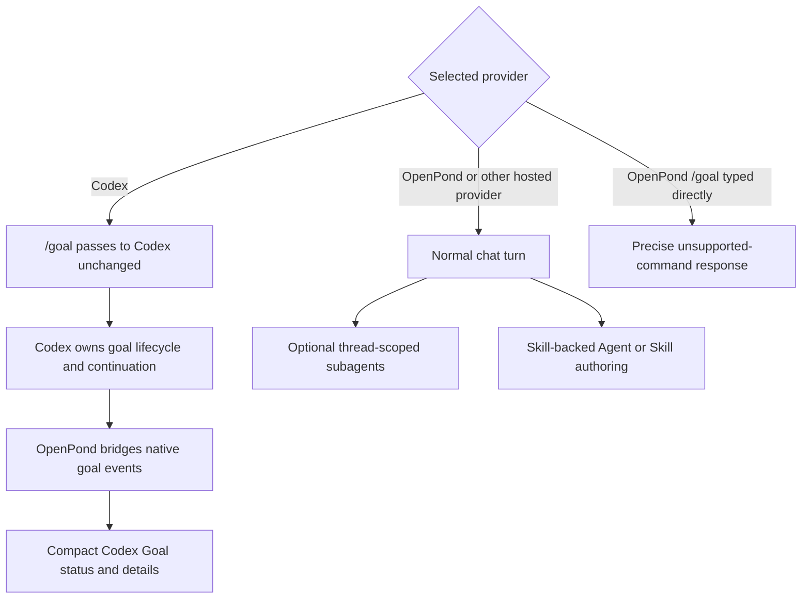

# Remove OpenPond Goals and Insights, Preserve Codex Goals

**Date:** 2026-07-27

**Status:** Implementation and local validation complete; PR publication and CI in progress

**Scope:** Delete OpenPond-owned Goal execution and the Insights system, preserve Codex-native Goal passthrough and presentation, keep normal thread-scoped subagents, and make Lab AI Suggestions the sole Suggestions view

> **Latest checkpoint — 2026-07-27:** The OpenPond-owned Goal runtime and Insights system are removed end to end. Codex-native Goal events, history recovery, `/goal`, and compact Goal presentation remain; `/goal` is hidden for non-Codex providers and rejected before model invocation if typed directly. Subagents now use parent-task scope only. Lab Suggestions renders retained Task Miner candidates without the former Insights/Observations system. The recent PR #49 cleanup had already made `/skill` and `/agent` normal bundled-skill turns, so this pass preserves `openpond-skill-authoring` and `openpond-agent-authoring` and deletes only obsolete Goal-adjacent scaffolding. The complete unit suite passes with 329 files, 1,630 tests, and 10 pre-existing legacy skips; `pnpm run verify:push` and isolated desktop smoke proof also pass.

Related docs:

- [Goal slash command design](../server/goal-slash-command.md) — historical design that introduced the shared Codex/OpenPond Goal surface; superseded for OpenPond-owned Goal execution by this plan.
- [Goals](../../public/goals.md) — public documentation to narrow to Codex-native support.
- [OpenPond Insights Agent](2026-07-01-openpond-insights-agent.md) — completed implementation history for the Insights system being removed.
- [Lab and Continuous Improvement](2026-07-15-harness-lab-continuous-improvement.md) — historical Lab information architecture and the decision to keep Task Miner AI Suggestions as optimizer v0.
- [Skill-Backed Agent and Skill Authoring](2026-07-23-skill-driven-agent-authoring.md) — establishes that Agent and Skill authoring no longer depend on Goal mode.
- [Subagent Lifecycle Working Notes](../../subagent-lifecycle-working-notes.md) — establishes that subagents are already thread-scoped first and do not require a Goal.

## Summary

OpenPond no longer needs its own Goal runtime. Normal turns are durable, Agent and Skill authoring now use normal skill-backed turns, background subagents already belong to a parent session, and explicit long-running Codex work can continue to use Codex's native Goal implementation. Keeping a second OpenPond Goal engine means maintaining duplicate lifecycle, continuation, persistence, budget, UI, and subagent-coupling paths without a distinct product requirement.

This plan removes the OpenPond-owned path while retaining Codex compatibility:



Insights is a separate removal decision. The current Lab Suggestions page contains two different systems:

- **Observations** is the Insights background agent and `insight_items` store.
- **AI suggestions** is the Task Miner and training-candidate system.

Removing Insights therefore does not remove AI Suggestions. It intentionally removes passive health observations, background scans, Insights questions, and usage-anomaly findings. The remaining Suggestions tab shows Task Miner candidates directly and continues to support review, reject, dismiss, merge, and create-plan actions.

This is a deletion track, not a migration from Insight rows into Task Miner candidates. The systems detect different things: Insights scans app/runtime health, while Task Miner finds repeated, consented, and verifiable work suitable for a training or workflow recommendation. Existing Insight rows do not become AI Suggestions.

## Expected Cleanup Size

Current direct ownership:

| Area | Direct production lines | Dedicated test lines | Notes |
| --- | ---: | ---: | --- |
| OpenPond CLI Goal runtime | 3,894 | 1,896 | `apps/cli/src/goal` plus its two tests |
| OpenPond server Goal control/runtime | 1,148 | 242 | Excludes Codex bridge/history and shared UI |
| Insights server, web, contracts, and route | 4,105 | 1,475 | Excludes shared settings/store/app-shell branches |
| **Directly owned total** | **9,147** | **3,613** | Full-file deletion before shared cleanup |

Shared Goal and Insights branches currently span turn running, SQLite schema/store code, app bootstrap, runtime indexes, sidebar composition, settings, usage attribution, Lab routing, chat rendering, and docs. The expected net reduction is approximately:

- **10,000–12,000 production lines**;
- **14,000–17,000 total lines** including tests and docs;
- **49 directly owned production files deleted**, plus focused simplification across shared files.

These were planning estimates. The final staged diff count is recorded in Phase 6 and the progress log.

## Current Code Review

### OpenPond-owned Goal runtime to remove

- [`apps/cli/src/goal`](../../../apps/cli/src/goal) contains the standalone Goal CLI, schemas, local/hosted state adapters, prompt assembly, budgets, approvals, artifacts, shell/file/source/check tools, and runner.
- [`command-registry.ts`](../../../apps/cli/src/cli/command-registry.ts) registers the top-level `openpond goal` command.
- [`goal-control.ts`](../../../apps/server/src/openpond/goal-control.ts) owns OpenPond Goal lifecycle records and transitions.
- [`runtime/goals`](../../../apps/server/src/runtime/goals) owns OpenPond continuation policy, model-tool control, and Goal-to-subagent lifecycle coupling.
- [`turn-runner.ts`](../../../apps/server/src/runtime/turn-runner.ts) creates the Goal control runtime, queues continuation jobs, pauses Goals, injects Goal continuation context, and applies Goal lifecycle changes to subagents.
- [`capability-tool-registry.ts`](../../../apps/server/src/openpond/capability-tool-registry.ts) advertises `openpond_goal_control` to hosted models.
- [`store-core.ts`](../../../apps/server/src/store/store-core.ts), [`store-schema.ts`](../../../apps/server/src/store/store-schema.ts), [`store-codecs.ts`](../../../apps/server/src/store/store-codecs.ts), and [`store.ts`](../../../apps/server/src/store/store.ts) own `openpond_thread_goals`, claim/release behavior, and `thread_goal` mutation projection.
- [`session-routes.ts`](../../../apps/server/src/api/routes/session-routes.ts) and [`session-api.ts`](../../../apps/web/src/api/session-api.ts) expose the OpenPond Goal pause endpoint.
- [`composer-slash-commands.ts`](../../../apps/web/src/lib/composer-slash-commands.ts) currently advertises `/goal`, `/goal-local`, and `/goal-remote` for every provider.
- [`HarnessSettingsSections.tsx`](../../../apps/web/src/components/settings/HarnessSettingsSections.tsx) exposes OpenPond Goal storage settings.

### Codex-native Goal support to preserve

- [`codex-bridge.ts`](../../../apps/server/src/runtime/codex-bridge.ts) translates Codex `thread/goal/updated` and `thread/goal/cleared` notifications into runtime events and clears stale active projection after terminal turns.
- [`codex-history.ts`](../../../apps/server/src/codex-history.ts) reconstructs active Goal state from Codex history files, native Goal records, and `<codex_internal_context source="goal">`.
- [`goal-runtime.ts`](../../../apps/web/src/lib/goal-runtime.ts) currently projects both OpenPond and Codex Goal records into one UI status model.
- [`codex-history-live-refresh.ts`](../../../apps/web/src/lib/codex-history-live-refresh.ts) keeps active Codex Goal history sessions live in the sidebar.
- [`ComposerGoalStrip.tsx`](../../../apps/web/src/components/chat/ComposerGoalStrip.tsx) presents compact Goal status above the composer.
- [`GoalDetailsView.tsx`](../../../apps/web/src/components/goal/GoalDetailsView.tsx) and [`WorkspaceDiffPanel.tsx`](../../../apps/web/src/components/workspace-diff/WorkspaceDiffPanel.tsx) present Goal and subagent details.
- [`goal-runtime.test.ts`](../../../tests/goal-runtime.test.ts), [`codex-history.test.ts`](../../../tests/codex-history.test.ts), [`codex-history-live-refresh.test.ts`](../../../tests/codex-history-live-refresh.test.ts), and Codex bridge tests cover the surviving projection.

Codex Goal support is upstream passthrough, not an OpenPond fallback runtime. Codex remains the lifecycle authority for objective, status, continuation, budget, completion, and native Goal commands.

### Subagent coupling to simplify

- [`subagents.ts`](../../../packages/contracts/src/subagents.ts) carries optional `parentGoalId` on child session/run contracts.
- [`tool-runtime.ts`](../../../apps/server/src/runtime/subagents/tool-runtime.ts) binds new subagents to an active OpenPond Goal when one exists.
- Subagent messaging, continuation, completion, child-turn, and repository runtimes propagate `parentGoalId`.
- Goal-specific lifecycle code gates completion, marks children `needs_resume`, cancels or supersedes children, and projects derived child counts into `thread_goal`.
- The watcher, review packet, cleanup, retained-workspace, and parent-session behavior already work without a Goal and must remain.

The replacement authority is `parentSessionId`. Removing Goal mode must not remove normal subagents, independent reviewer flows, copy-on-write workspaces, parent wakes, packet review, retention cleanup, or thread-scoped UI.

### Insights system to remove

- [`apps/server/src/insights`](../../../apps/server/src/insights) contains the background loop, system project/session, evidence detectors, usage-anomaly detector, model-backed scan/question service, and structured row updates.
- [`insights-routes.ts`](../../../apps/server/src/api/routes/insights-routes.ts) and the server route table expose list, scan, ask, and status updates.
- [`insights.ts`](../../../packages/contracts/src/insights.ts) defines Insight items, runs, summaries, evidence-source settings, and API responses.
- The SQLite store owns `insight_items`, source/run links, status transitions, and indexes.
- [`useInsights.ts`](../../../apps/web/src/hooks/useInsights.ts) owns client loading, scan, ask, filter, and row mutation.
- [`InsightsView.tsx`](../../../apps/web/src/components/insights/InsightsView.tsx) renders Observations, run history, filters, questions, scanning state, and source/run links.
- [`chat-insights.ts`](../../../apps/web/src/lib/chat-insights.ts) and [`MessageInsightsRunPrompt.tsx`](../../../apps/web/src/components/chat/MessageInsightsRunPrompt.tsx) special-case hidden Insights prompts in chat history.
- Top-bar, sidebar, app-shell, Settings, usage, and Get Started code contain Insights-specific navigation and presentation.
- `insightsEnabled`, `insightsModelRef`, and `insightsEvidenceSources` live in application preferences.
- `/insights` and right-chat command policy open or query this system.

### AI Suggestions to retain

- [`TrainingSuggestions.tsx`](../../../apps/web/src/components/training/TrainingSuggestions.tsx) renders Task Miner candidates and supports create plan, reject, dismiss, and merge.
- [`task-miner.ts`](../../../apps/server/src/training/task-miner.ts) finds repeated consented workflows, computes scorecards, and persists candidates.
- [`task-mining.ts`](../../../packages/contracts/src/task-mining.ts) owns Task Candidate evidence, scorecard, recommendation, status, and run contracts.
- [`LabsRouteSections.tsx`](../../../apps/web/src/components/labs/LabsRouteSections.tsx) currently places `InsightsView` under Observations and `TrainingSuggestions` under AI Suggestions.
- [`LabsRoute.tsx`](../../../apps/web/src/components/labs/LabsRoute.tsx) currently adds active Insight rows and Task Miner candidates into one suggestion count.

The retained product is the Task Miner candidate system. No Insights contract, detector, row, run, or background job is required to render or act on AI Suggestions.

## Product Decision

### Preserve Codex Goal mode as provider-native behavior

`/goal` remains available only when the selected provider is Codex.

- The composer shows `/goal` for Codex sessions and Codex-targeted new chats.
- The client sends the complete `/goal ...` command to Codex unchanged.
- OpenPond does not parse the objective, create a local Goal record, inject continuation prompts, or expose `openpond_goal_control`.
- Codex native notifications and history remain the sole Goal source of truth.
- OpenPond continues to display compact status, elapsed time, budget information when supplied, completion state, and Goal details from Codex events.
- `/goal pause`, `/goal resume`, `/goal clear`, and other Codex-supported forms remain Codex commands rather than OpenPond APIs.
- A directly typed `/goal` on a non-Codex provider fails before model invocation with a precise “Codex-only command” response and creates no Goal event.
- The slash menu hides `/goal` for non-Codex providers rather than advertising an unsupported feature.

The retained UI and internal types should be renamed toward Codex ownership where practical, for example `CodexGoalRuntimeStatus` and `codex-goal-runtime.ts`. Raw upstream event names remain unchanged so the bridge accurately represents Codex.

### Remove OpenPond Goal execution completely

Delete:

- `/goal-local` and `/goal-remote`;
- OpenPond-hosted `/goal`;
- `openpond goal` and the entire CLI Goal runtime;
- `openpond_goal_control`;
- OpenPond Goal continuation jobs, prompts, budgets, claims, lifecycle transitions, and pause endpoint;
- `openpond_thread_goals` and its claim/projection helpers;
- Goal storage settings and `.openpond/goals`/`~/.openpond/goals` guidance;
- OpenPond Goal-specific usage attribution and context resources when no surviving caller exists;
- Cloud Goal launch copy and queued Goal behavior;
- Goal-scoped subagent completion, resume, stop, restart, and projection coupling.

Do not retain a hidden hosted fallback, natural-language Goal trigger, compatibility alias, or provider shim. Normal hosted turns remain normal turns.

### Make subagents thread-scoped only

Subagents continue to belong to a parent session.

- Remove `parentGoalId` from new subagent records and APIs after the call-site/storage audit.
- Scope watcher dedupe, parent wake, messaging, review, and cleanup by `parentSessionId`.
- Preserve required/optional semantics within the parent thread's review state rather than Goal completion.
- Preserve child `submitted_for_review`, parent acceptance/revision/dismissal, evidence packets, worktree/sandbox isolation, retained-workspace expiry, and cleanup.
- Move any surviving subagent review/cleanup UI out of `GoalDetailsView` into a thread/subagent details surface before deleting Goal-only presentation.
- Codex Goal projection does not become authority over OpenPond subagent runs.

### Remove Insights instead of folding it into Suggestions

Delete the Insights system end to end:

- background startup/interval/manual scans;
- model-backed scan and question turns;
- hidden `openpond.insights` project/session behavior;
- evidence detectors and usage anomaly scanner;
- `insight_items`, codecs, store methods, and APIs;
- `/insights`;
- Observations UI, run history, questions, filters, top-bar indicator, settings, and special chat rendering;
- Insights-specific preference and usage fields;
- Insights-specific Get Started and navigation copy.

Do not convert stored Insight rows into Task Miner candidates. Remove the Insights-only system project/session and Insight rows as part of the WIP schema cleanup once the exact destructive migration is approved.

### Make AI Suggestions the sole Suggestions view

The Lab tab remains named **Suggestions**, but its content is only `TrainingSuggestions`.

- Remove the Observations/AI suggestions subtab switcher.
- Render the retained AI Suggestions heading, candidate cards, and empty state directly.
- Count only non-retired Task Miner candidates in the Lab tab badge.
- Keep create-plan, merge, reject, dismiss, evidence, recommendation, and scorecard behavior.
- Keep Task Miner opt-in/consent behavior and the Automatic New Model entry that populates candidates.
- Update copy that says “Insights,” “Observations,” “Signals,” or combined suggestion count where it refers to the removed system.
- Do not add a replacement background scanner in this track.

The product accepts the lost Insights scope: there will be no passive stuck-turn, failed-tool, abandoned-Goal, user-correction, or usage-anomaly observation feed after removal. AI Suggestions cover repeated-work opportunities, not general app health.

## Implementation Shape

### Surviving Codex Goal flow

```mermaid
sequenceDiagram
    participant UI
    participant Server
    participant Codex
    participant Events

    UI->>Server: /goal objective on Codex session
    Server->>Codex: pass native command through
    Codex-->>Server: thread/goal/updated
    Server->>Events: provider=codex, kind=thread_goal
    Events-->>UI: Codex Goal status/details
    Codex-->>Server: thread/goal/cleared
    Server->>Events: provider=codex, kind=thread_goal_cleared
    Events-->>UI: clear Codex Goal projection
No OpenPond Goal table, claim, tool, or continuation queue participates.

### Surviving Suggestions flow

```mermaid
flowchart LR
    C["Selected consented chats"] --> M["Task Miner"]
    M --> K["Task Candidates"]
    K --> L["Lab · Suggestions"]
    L --> R{"User decision"}
    R -->|"Create plan"| P["Training/Taskset authoring"]
    R -->|"Merge"| G["Merged candidate"]
    R -->|"Reject or dismiss"| D["Candidate status update"]
```

No Insights scan, row, run, system session, or model question participates.

### Storage cleanup

The clean schema removes:

- `openpond_thread_goals`;
- `insight_items`;
- Goal claim/release helpers and migration entry;
- Insights row codecs and queries;
- subagent `parent_goal_id` if the audit proves no surviving non-Goal owner;
- Insights-only session/project enum values and metadata;
- Insights-only preference and usage fields.

Generic runtime events remain. Codex `thread_goal` and `thread_goal_cleared` events remain valid and are projected directly from the runtime event stream; they must not repopulate an OpenPond Goal table.

### UI cleanup

Keep the smallest provider-native Goal presentation:

- compact Codex Goal strip;
- Codex Goal detail view;
- sidebar/live refresh for active Codex history tasks.

Split reusable subagent details from the current combined `GoalDetailsView` before deleting OpenPond/CreateImprove/Goal-only branches. The resulting component ownership should not call a normal subagent run a Goal.

Remove Insights controllers and props from app-shell and Lab composition rather than filling them with empty placeholder values.

## Migration and Removal Map

| Current area | Action | Completion proof |
| --- | --- | --- |
| `apps/cli/src/goal` | Delete and remove `openpond goal` registration/docs/assets | CLI registry and generated command reference have no Goal command |
| `openpond_goal_control` | Delete schema, handler, prompt description, and catalog entry | Hosted tool catalogs contain no Goal control tool |
| `apps/server/src/runtime/goals` | Delete OpenPond control, continuation, and Goal-subagent lifecycle modules | Normal hosted turns complete without Goal continuation jobs |
| `openpond_thread_goals` | Remove table, migration, codecs, claims, and lookup methods | Clean and upgraded databases start without the table |
| `/goal-local`, `/goal-remote` | Remove menu items, routing, Cloud copy, tests, and docs | Repository search finds no executable command |
| `/goal` | Gate to Codex provider; reject elsewhere before model turn | Codex goal E2E passes; hosted provider negative test passes |
| Codex Goal bridge/history | Preserve and isolate from OpenPond types | Native update/clear/history recovery tests pass |
| Goal UI | Narrow to Codex projection; extract subagent details | Codex status remains visible and thread subagents remain manageable |
| `parentGoalId` | Remove from OpenPond subagent contracts/storage/runtime where safe | Thread-scoped subagent lifecycle suite passes |
| `apps/server/src/insights` | Delete all Insights service/background/detector modules | No Insights queue, scan, or system session starts |
| Insights API/contracts/store | Delete routes, schemas, `insight_items`, and preferences | Route table, clean schema, and upgraded schema contain no Insights surface |
| Insights web UI | Delete view/hook/chat/topbar/settings/navigation/CSS | No `/insights`, Observations, or Insights controls render |
| Lab Suggestions | Render `TrainingSuggestions` directly | Candidate count/actions/empty state pass focused UI tests |
| Public docs | Rewrite Goals as Codex-only; remove Insights product claims | Docs describe only surviving behavior |

## Boundaries

This track does:

- remove OpenPond-owned Goal execution;
- remove Insights entirely;
- preserve Codex-native Goal support in OpenPond;
- simplify subagents to parent-thread authority;
- keep Task Miner AI Suggestions;
- clean dead contracts, persistence, APIs, UI, settings, tests, and docs.

This track does not:

- remove or change Goal mode inside Codex;
- implement a second Codex Goal runtime or local fallback;
- make `/goal` work on hosted OpenPond models;
- preserve `/goal-local`, `/goal-remote`, or `openpond goal`;
- replace Insights with another background health scanner;
- migrate Insight rows into Task Miner candidates;
- remove Task Miner, Task Candidates, Tasksets, training plans, or AI Suggestions;
- remove normal subagents or their watcher/review/cleanup behavior;
- change Agent or Skill authoring back to a Goal-backed path;
- retain legacy fallback branches solely for old WIP behavior.

## Phased Plan

### Phase 0 — Freeze the deletion boundary

- [x] Separate OpenPond Goal execution from Codex Goal passthrough. Done — Evidence: Codex bridge/history/runtime tests remain active while all OpenPond Goal runtime modules are deleted.
- [x] Confirm Lab AI Suggestions do not depend on Insights. Done — Evidence: `TrainingSuggestions` reads Task Miner candidates directly and the full Lab/task-miner unit coverage passes without Insights services.
- [x] Inventory direct ownership and shared integration points. Done — Evidence: the removal map covers CLI, server, persistence, contracts, web, tests, docs, subagent coupling, and generated command docs.
- [x] Capture preserved-behavior characterization. Done — Evidence: Codex history/bridge/goal-runtime suites, Task Miner/Lab suites, and the complete unit suite pass with the removed systems absent.

Exit gate: every preserved behavior has a focused test that does not instantiate an OpenPond Goal or Insights service.

### Phase 1 — Isolate Codex Goal passthrough

- [x] Narrow Goal projection to Codex-native records and events. Done — Evidence: `goal-runtime.ts` rejects non-Codex Goal records and `goal-runtime.test.ts` covers Codex status, clear, elapsed-time, terminal, and sidebar projection behavior.
- [x] Make `/goal` provider-aware and preserve Codex passthrough. Done — Evidence: composer command filtering shows `/goal` only for Codex, while the parser keeps the command intact for server dispatch.
- [x] Reject non-Codex `/goal` before model invocation. Done — Evidence: `byok-turn-runner.test.ts` asserts the precise rejection and zero provider stream calls.
- [x] Preserve Codex live/history presentation. Done — Evidence: Codex bridge, history, live-refresh, runtime, and Goal details suites pass with OpenPond Goal code absent.

Exit gate: Codex Goal mode works through native Codex authority with all OpenPond Goal runtime modules disabled in the test harness.

### Phase 2 — Remove OpenPond Goal runtime and CLI

- [x] Delete the CLI Goal runtime and command. Done — Evidence: `apps/cli/src/goal`, its dedicated tests, registration, and generated `openpond goal` reference are absent; all 14 CLI test files pass.
- [x] Delete server Goal control and continuation. Done — Evidence: `goal-control.ts`, `runtime/goals`, `openpond_goal_control`, continuation/pause/budget/claim paths, and Goal storage settings are absent from executable code.
- [x] Remove OpenPond Goal aliases and persistence. Done — Evidence: `/goal-local` and `/goal-remote` parse only as negative regressions; schema v33 drops former Goal tables and removes Goal scope from subagent rows.
- [x] Preserve Codex Goal events and generic runtime infrastructure. Done — Evidence: native `thread_goal`/`thread_goal_cleared` bridge coverage and the complete unit suite pass.

Exit gate: repository search finds no executable OpenPond Goal runtime, tool, command, table, continuation, or provider fallback.

### Phase 3 — Make subagents thread-scoped only

- [x] Remove Goal lifecycle coupling from child execution. Done — Evidence: Goal completion/resume/restart/stop handlers are deleted and generic lifecycle code lives under `runtime/subagents`.
- [x] Remove Goal scope from subagent contracts and persistence. Done — Evidence: `parentGoalId` and `goal_scoped` are absent from current contracts/runtime; schema v33 converts cached legacy payloads to `parent_scoped`.
- [x] Preserve parent-task lifecycle behavior. Done — Evidence: subagent store, child lifecycle, runtime indexes, context compaction, terminal scope, and UI projection tests pass.
- [x] Retire Goal-scoped scenarios and update guidance. Done — Evidence: the Goal-scoped desktop scenario is deleted and `subagent-lifecycle-working-notes.md` now records parent-task scope as current authority.

Exit gate: the full normal subagent lifecycle passes with no Goal object, Goal ID, or Goal details component.

### Phase 4 — Remove Insights backend and persistence

- [x] Delete Insights services and scheduling. Done — Evidence: `apps/server/src/insights`, its background startup, route, and service dependencies are absent.
- [x] Delete Insights contracts, preferences, usage, API, and system-session behavior. Done — Evidence: executable-code audits find no Insights settings, routes, system kind, or usage attribution.
- [x] Retire Insights persistence. Done — Evidence: schema v33 drops `insight_items` and related tables; the SQLite migration/index test asserts retired Goal/Insights tables are absent.
- [x] Delete dedicated Insights tests. Done — Evidence: detector, loop, view, and sidebar-visibility tests are removed rather than skipped.

Exit gate: startup creates no Insights project/session, queues no Insights job, and exposes no Insights route or storage table.

### Phase 5 — Simplify Lab Suggestions and remove Insights UI

- [x] Delete the Insights client and presentation. Done — Evidence: `InsightsView`, `useInsights`, chat projection, top-bar indicator, CSS, API, settings, and command routing are absent.
- [x] Make Task Miner the sole Suggestions content. Done — Evidence: Lab renders `TrainingSuggestions` directly, without an Observations subtab or combined Insights count.
- [x] Preserve candidate actions and states. Done — Evidence: Task Miner, Lab, training suggestion, navigation, and complete unit suites pass.
- [x] Remove public Insights guidance. Done — Evidence: `continuous-insights.md` and its public index entry are deleted.

Exit gate: Lab Suggestions operates entirely from Task Miner/training state and the application contains no visible or callable Insights feature.

### Phase 6 — Documentation, cleanup, and proof

- [x] Rewrite Goal and related working guidance. Done — Evidence: public Goals is Codex-only, the original Goal design is marked historical, the authoring doc records the combined boundary, and subagent notes identify the thread-only architecture.
- [x] Remove stale public Insights material and generated CLI Goal docs. Done — Evidence: the public page is deleted and `pnpm --dir apps/cli docs:commands` regenerated the command reference without `openpond goal`.
- [x] Run focused and complete unit coverage. Done — Evidence: `pnpm test:unit` passed 315 server/web files with 1,557 tests and 10 skips, then 14 CLI files with 72 tests.
- [x] Run remaining static, build, repository hygiene, and diff checks. Done — Evidence: `pnpm run verify:push` passed the locked install, TypeScript builds, application and CLI builds, runtime/package smoke checks, budgets, structure, reachability, dependency, hygiene, workflow, unit, integration, Python, Node-contract, Agent SDK, and release suites; `git diff --check` also passes.
- [x] Run local application smoke proof. Done — Evidence: `OPENPOND_APP_HOME=<isolated-temp-dir> pnpm dev` reached server, renderer, and desktop readiness; the in-app browser showed `/agent` and `/skill` but no `/goal` for OpenPond, showed both bundled authoring skills, and showed only Task Miner AI Suggestions with no Observations/Insights surface.
- [x] Record final line/file deletion count. Done — Evidence: the staged implementation changes 197 files, deletes 61 files and 17,878 lines, adds 5 focused files and 2,692 lines (including the combined working docs), for a net reduction of 15,186 lines.
- [ ] Commit, publish the PR, and record the CI result.

Exit gate: all surviving behavior passes, docs describe only the surviving architecture, and no OpenPond Goal or Insights code path remains.

## Validation Plan

### Repository audits

Expected absent after implementation:

```text
apps/cli/src/goal
openpond_goal_control
/goal-local
/goal-remote
openpond_thread_goals
apps/server/src/insights
/v1/insights
/insights
INSIGHTS_SYSTEM_KIND
insight_items
insightsEnabled
insightsModelRef
insightsEvidenceSources
```

Expected present after implementation:

```text
thread/goal/updated
thread/goal/cleared
provider: "codex"
codexGoalRuntime
<codex_internal_context source="goal">
TaskCandidate
TaskMiner
TrainingSuggestions
```

### Automated commands

Completed:

- `pnpm run verify:push` — passed. This includes the locked install; workspace, CLI, and Agent SDK typechecks; application and CLI builds; CLI package/runtime smoke; budgets; structure, reachability, dependency, hygiene, and workflow checks; unit and integration tests; Python; Node-contract; Agent SDK; and release suites.
- `pnpm test:unit` — passed 315 server/web files with 1,558 tests and 10 pre-existing skips, plus 14 CLI files with 72 tests.
- `pnpm exec vitest run tests/sqlite-store.test.ts` — passed all 15 tests after adding the v33 destructive-upgrade proof for hidden Insights state, legacy usage records, retired tables, and preserved parent-scoped subagent state.
- `pnpm --dir apps/cli docs:commands` — regenerated the command reference without `openpond goal`.
- `pnpm run structure:check`, `pnpm run reachability:check`, `pnpm run hygiene:check`, and `git diff --check` — passed.

The first package-budget attempt included an unrelated ignored local tutorial video. A clean `origin/master` comparison and a branch archive excluding the ignored file both passed the budget; the video was restored unchanged and is not part of this diff.

Baseline before removal:

- `pnpm test:unit` passed on 2026-07-27: 378 files, 1,966 tests passed, 29 skipped.
- TypeScript project builds and `pnpm agent-sdk:check` passed on 2026-07-27 during the skill-backed authoring track.

### Desktop acceptance

The isolated local application smoke covered the directly inspectable removal surfaces:

- OpenPond Chat advertised `/agent` and `/skill` but not `/goal`.
- Both bundled authoring skills were available to normal skill-backed turns.
- Lab Suggestions rendered the Task Miner “AI suggestions” heading and empty state directly, with no Observations/Insights UI.
- Server, renderer, and desktop readiness completed with an isolated application home and no Insights startup path.

The remaining provider-native scenarios are covered by automated tests because the smoke profile did not have an interactive Codex task prepared:

1. A Codex chat shows `/goal` in the command menu.
2. `/goal <objective>` reaches Codex and native Goal status appears without an OpenPond Goal tool call.
3. Codex pause/resume/clear/completion updates and history recovery still project correctly.
4. An OpenPond hosted chat does not advertise `/goal`; directly typing it produces the precise Codex-only response without invoking the model.
5. `/goal-local`, `/goal-remote`, and `/insights` are absent.
6. No Goal storage or Insights settings remain.
7. Lab Suggestions shows Task Miner candidates directly with no Observations subtab.
8. Suggestion create-plan, merge, reject, dismiss, and empty-state behavior works.
9. Startup creates no Insights job, session, project, top-bar indicator, or network request.
10. Thread-scoped subagent start, progress, submission, review, revision, acceptance/dismissal, and cleanup work without a Goal.
11. A clean database and an upgraded database containing former Goal/Insights rows both start successfully under the chosen cleanup policy.

## Resolved Decisions

1. **Existing Insights data:** schema v33 permanently removes `insight_items`, `openpond_thread_goals`, the hidden Insights system session and local project, and their associated usage/turn/event/approval rows.
2. **Codex Goal copy:** compact provider-native UI retains the short “Goal” label, while public documentation makes Codex ownership explicit.
3. **Historical usage fields:** inactive Insights and OpenPond Goal-control request kinds are removed from current contracts; schema v33 deletes legacy `insights_scan`, `insights_question`, and `goal_control` usage rows rather than maintaining unreadable compatibility data.

## Progress Log

### 2026-07-27 — Removal boundary captured

- Audited the dedicated OpenPond Goal CLI/server runtime, shared Goal UI, Codex Goal bridge/history, Goal persistence, and subagent coupling.
- Confirmed that full Goal deletion would remove Codex support, then narrowed the plan to preserve Codex-native Goal events, history, `/goal`, and presentation.
- Audited the Insights server, storage, API, settings, chat projection, and UI.
- Confirmed that Lab currently composes Insights as Observations and Task Miner candidates as AI Suggestions; AI Suggestions do not require Insights.
- Chose to remove Observations/Insights without migrating its health findings into Task Miner.
- Estimated 9,147 directly owned production lines and 3,613 dedicated test lines before shared cleanup.
- Created this implementation plan. No production code, schema, UI, tests, or runtime behavior changed.

### 2026-07-27 — Goal and Insights removal implemented

- Deleted the OpenPond CLI Goal command/runtime, server control and continuation runtime, hosted Goal tool, pause API, storage/settings branches, and provider aliases.
- Preserved Codex-native `/goal`, native Goal event/history recovery, and compact Goal presentation; non-Codex `/goal` now fails before provider invocation.
- Deleted the Insights service, scheduler, routes, contracts, persistence API, settings, usage attribution, client/UI, navigation, command surface, and public documentation.
- Made Task Miner `TrainingSuggestions` the direct and sole Lab Suggestions content.
- Removed Goal scope from subagent contracts, persistence, runtime, tests, and docs while retaining normal parent-task lifecycle, messaging, review, wake, and cleanup behavior.
- Kept the PR #49 authoring architecture intact: `/skill` and `/agent` remain ordinary skill-backed turns using `openpond-skill-authoring` and `openpond-agent-authoring`, with no special mode, tool, or `agents/openai.yaml`.
- Added schema v33 destructive cleanup for Goal/Insights tables, hidden Insights sessions/projects and associated records, legacy usage request kinds, and legacy subagent Goal fields; focused migration coverage proves parent-task subagent state survives.
- Passed the complete `pnpm run verify:push` pipeline, the post-migration focused SQLite suite, repository diff checks, and isolated in-app desktop smoke proof; the final staged implementation is a net 15,186-line reduction across 197 files.
